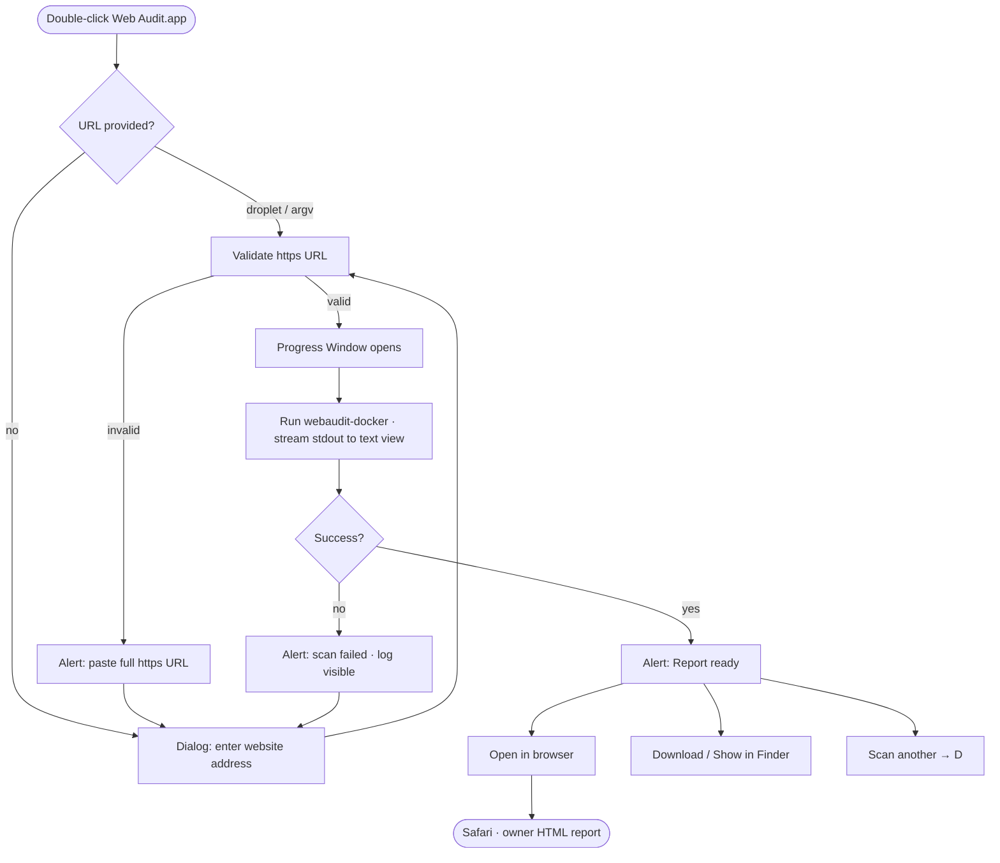
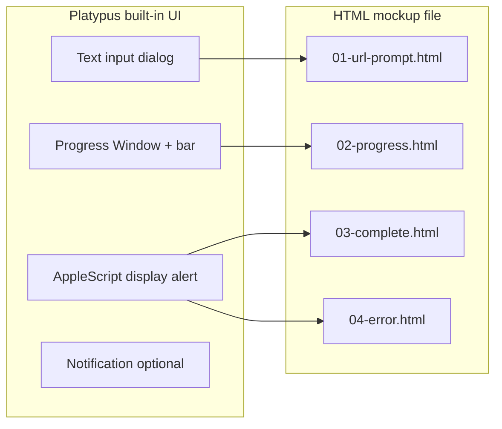

# Web Audit Platypus app — user flow

Same journey as [Swift mockups](../swift/user-flow.md); Platypus uses **dialogs + Progress Window** instead of one custom window.

---

## Happy path



---

## Platypus UI mapping



---

## State model (script-side)

Not separate views — **one script run** per scan:

```text
1. Resolve URL (dialog or $1)
2. Open Progress Window (Platypus automatic when script runs)
3. echo progress · webaudit-docker streams -v output
4. osascript completion dialog
5. open report.html OR exit
```

Optional **second Platypus app** for Help only — usually overkill; menu link to GitHub doc is enough.

---

## Auto vs click

| Step | Automatic? |
|------|------------|
| Show Progress Window when script starts | Yes (Platypus) |
| Log scrolls as stdout arrives | Yes |
| Transition to “Report ready” dialog | Yes (script reaches osascript) |
| Open browser | User picks button on dialog |
| Help | User opens Help menu / OK on help dialog |

---

## Window spec

| Property | Platypus default / mockup |
|----------|---------------------------|
| Progress Window | ~520 × 380 px (adjust in Platypus.app) |
| Text view font | Menlo 11pt (matches `webaudit -v`) |
| Remain open after execution | **On** — so Jill can read log |
| Droplet mode | Optional — drag URL onto app icon |

---

## What Platypus cannot do (vs Swift)

- Custom branded single-window layout (dialogs only)
- Smooth in-window state animation
- App Store polish / ShareLink without shell hacks
- iPhone (macOS only — same as Swift desktop)

**Good enough for:** QA prototype, internal distribution, `.app` in Downloads before Swift v2.
