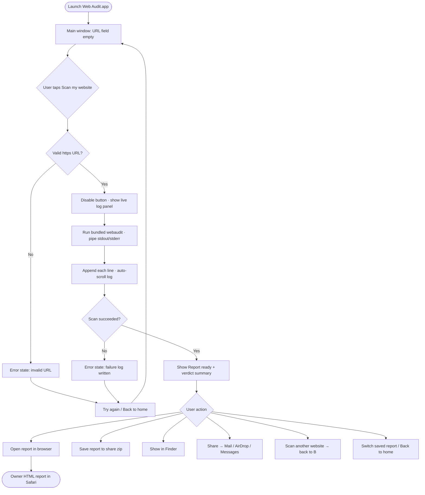
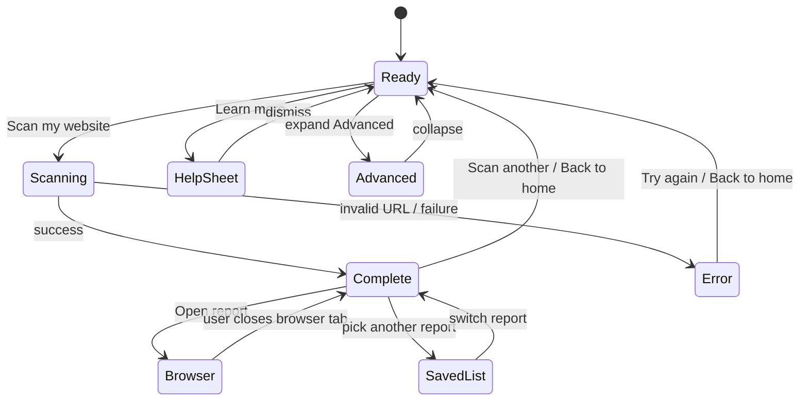
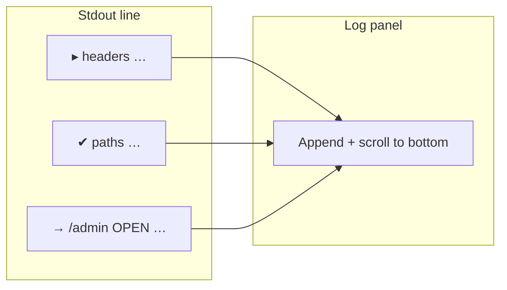
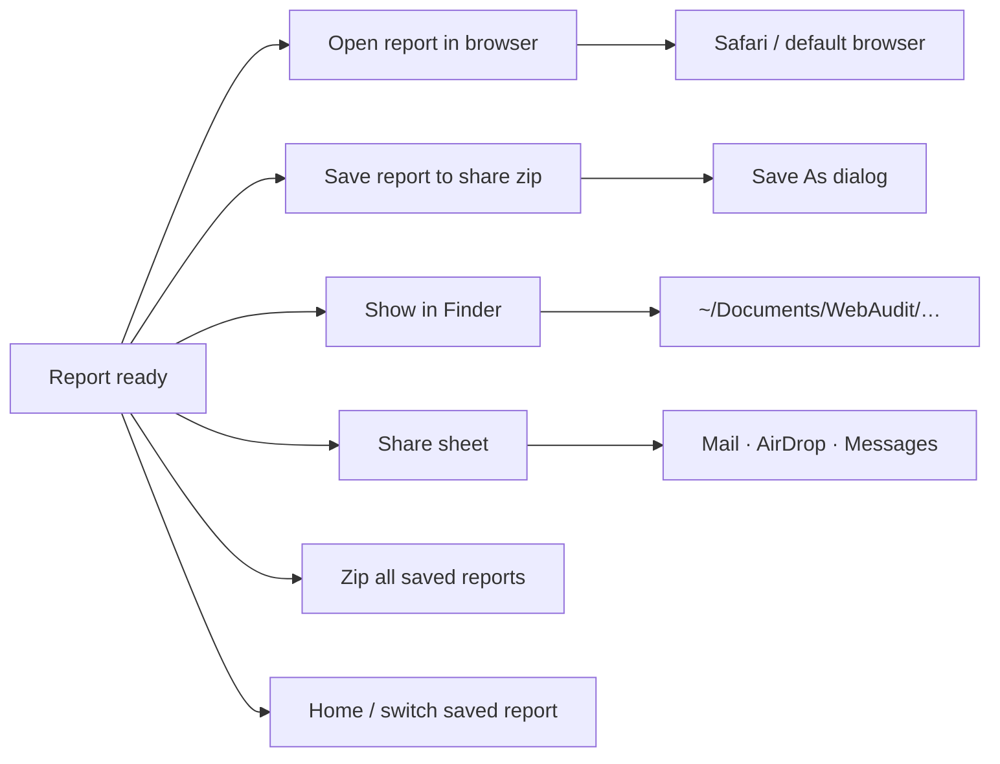

# Web Audit Mac app — user flow

*Companion to HTML mockups in this folder. Renders on GitHub; also embedded in [index.html](index.html).*

**Install paths:** [DELIVERY_PATHS.md](../../DELIVERY_PATHS.md) — public DMG (bundled engine) vs dev (Docker/venv).

---

## Happy path (site owner — public DMG)



---

## Information architecture (one window)



---

## Step label mapping (scan progress)

Primary UX is the **scrolling live log** (same lines as `webaudit scan -v`). Optional headline can track the current `▸` step:



---

## Post-scan actions



---

## What we deliberately hide (public DMG)

```mermaid
flowchart TB
  subgraph main [Main UI — site owner]
    URL[Website URL]
    BTN[Scan button]
    LOG[Live log]
    OPEN[Open / Share / Saved reports]
  end

  subgraph advanced [Advanced disclosure only]
    VER[webaudit version]
    PATH[Output folder path]
    ENG[Engine policy: bundled]
  end

  subgraph never [Not in public install copy]
    DOCK[Docker setup]
    GHCR[GHCR / image pull]
    TERM[Terminal commands]
  end

  URL --> BTN --> LOG --> OPEN
  advanced -.->|optional| main
  never -.x main
```

---

## Engine options (implementation, not main UI)

| Path | Engine | User sees |
|------|--------|-----------|
| **A — Public DMG** | Bundled `Resources/Engine/bin/webaudit` | Same mockups — no Docker |
| **C — Dev app** | `webaudit-docker` or `.venv` / PATH | Advanced shows external engine |
| **Deferred** | Platypus + shell wrapper | Mockups only — [../platypus/](../platypus/) |

See [DELIVERY_PATHS.md](../../DELIVERY_PATHS.md).

---

## Window spec (Swift target)

| Property | Value |
|----------|--------|
| Default size | ~1280 × 1240 pt (resizable; mockups are smaller) |
| Style | Standard titled window, traffic lights |
| Primary action | Scan my website (default button) |
| Reports path | `~/Documents/WebAudit/` |
| Failure logs | `~/Documents/WebAudit/Logs/` |
| Branding | Footer: Powered by [muzar.io](https://muzar.io/) · [GitHub](https://github.com/Vlad-1618M) · © Vtools |
| Help | **Learn more** → plain-English doc, install guide, shell V1, contact |
