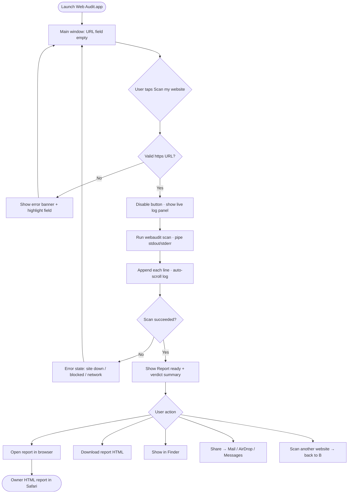
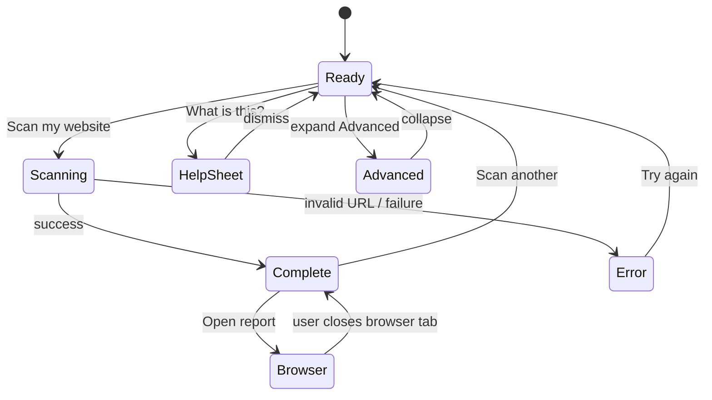
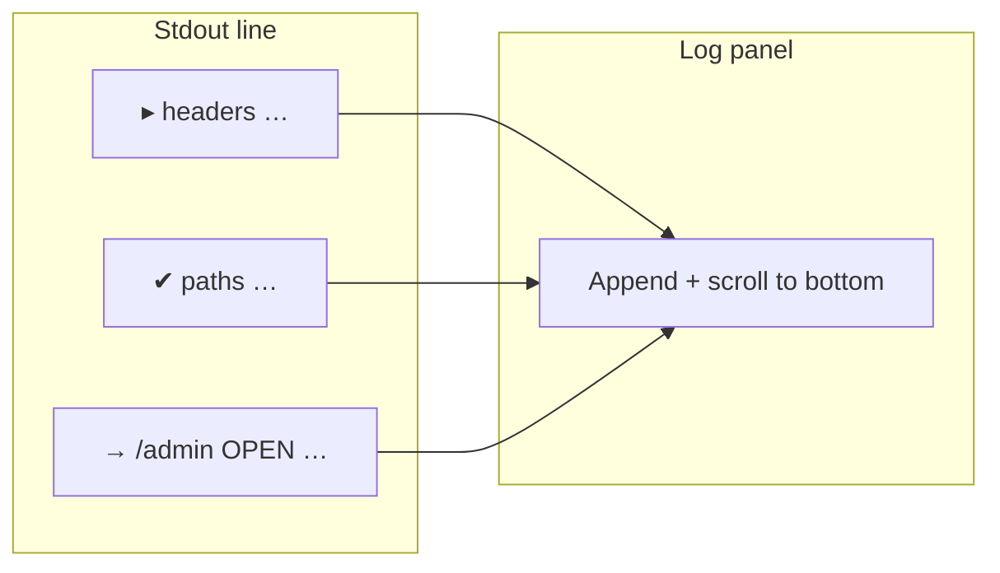
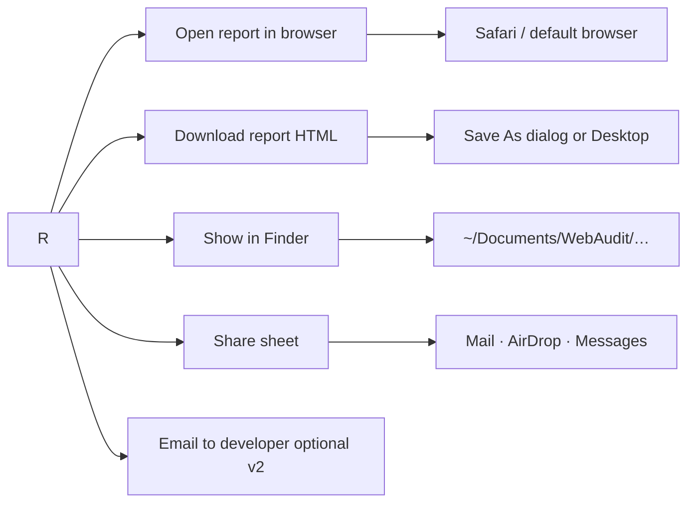

# Web Audit Mac app — user flow

*Companion to HTML mockups in this folder. Renders on GitHub; also embedded in [index.html](index.html).*

---

## Happy path (site owner)



---

## Information architecture (one window)



---

## Step label mapping (scan progress)

Primary UX is the **scrolling live log** (same lines as `webaudit scan -v`). Optional headline can track the current `▸` step:



Friendly step summaries (optional subtitle) still map from pipeline names — see earlier mockup iteration in git history.

---

## Post-scan actions



---

## What we deliberately hide

```mermaid
flowchart TB
  subgraph main [Main UI — Jill]
    URL[Website URL]
    BTN[Scan button]
    STEPS[Friendly steps]
    OPEN[Open / Share]
  end

  subgraph advanced [Advanced disclosure only]
    VER[webaudit version]
    PATH[Output folder path]
    LOG[Copy log]
  end

  subgraph never [Not in owner v1]
    DOCK[Docker]
    GHCR[GHCR / image pull]
    TERM[Terminal]
  end

  URL --> BTN --> STEPS --> OPEN
  advanced -.->|optional| main
  never -.x main
```

---

## Engine options (implementation, not UI)

| Phase | Engine | Jill sees |
|-------|--------|-----------|
| Prototype | Platypus + `webaudit-docker.sh` | Same mockups |
| v1 app | Bundled `webaudit` in app Resources | Same mockups |
| Dev-only | Docker via Advanced | Hidden by default |

---

## Window spec (Swift target)

| Property | Value |
|----------|--------|
| Default size | 480 × 420 pt (resizable min 440 × 380) |
| Style | Standard titled window, traffic lights |
| Primary action | Scan my website (default button) |
| Reports path | `~/Documents/WebAudit/` default |
| Branding | Footer: Powered by [muzar.io](https://muzar.io/) · [GitHub](https://github.com/Vlad-1618M) · © Vtools. All rights reserved. |
| External links | Help → GitHub plain-English doc or your site |
