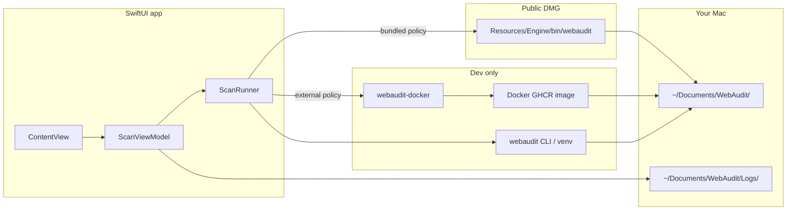

# Web Audit Pro for Mac — Swift notes

**Status:** **0.1.0-beta** · **Public DMG:** bundled Python engine + Playwright (no Docker) · **Dev:** external engine (Docker / venv / PATH)

**Audience:** Non-Swift developers who need to navigate the GUI code, packaging, and how it talks to `webaudit`.

**Delivery paths (all install options):** [DELIVERY_PATHS.md](../../DELIVERY_PATHS.md) · **Versions / tags:** [VERSIONING_AND_TAGS.md](../../VERSIONING_AND_TAGS.md)

**Quick links**

| Resource | Path |
|----------|------|
| Build & run (short) | [README.md](README.md) |
| macOS orchestrator | [../orchestrate-macos.sh](../orchestrate-macos.sh) |
| HTML wireframes | [designs/swift/](../../designs/swift/) |
| User-flow diagrams | [designs/swift/user-flow.md](../../designs/swift/user-flow.md) |
| Docker engine (dev / path B) | [v2_python_core/docs/docker_ci.md](../../v2_python_core/docs/docker_ci.md) |
| Plain-English copy | [v2_python_core/docs/getting_started_plain.md](../../v2_python_core/docs/getting_started_plain.md) |

---

## What this app is

A **native macOS window** for site owners who do not want Terminal. Paste a URL, watch a live log, read scores in-app, open the full HTML report, share a zip.

**One SwiftUI codebase, two engine policies:**

| Policy | Who | Engine |
|--------|-----|--------|
| **`bundled`** | Public `WebAudit-*-macOS.dmg` | `Web Audit.app/Contents/Resources/Engine/bin/webaudit` (Python + package inside app) |
| **`external`** | `run-dev.sh`, dev DMG | Host: `webaudit-docker` → `webaudit` CLI → bundled fallback |

Set via `Info.plist` key `WEBAUDITEnginePolicy` or env `WEBAUDIT_ENGINE_POLICY`.

Compare with mockups: [designs/swift/user-flow.md](../../designs/swift/user-flow.md).

---

## Packaging (not “future” — shipped)

| Track | Command | DMG | `INSTALL.txt` |
|-------|---------|-----|----------------|
| **Public** | `orchestrate-macos.sh public-dmg` | `installers/WebAudit-*-macOS.dmg` | No Docker — bundled engine |
| **Dev** | `orchestrate-macos.sh dev-dmg` | `installers/WebAudit-*-macOS-dev.dmg` | Docker / venv setup |

Scripts: [macos/packaging/](../packaging/). Output: [macos/installers/](../installers/) (gitignored `*.dmg`).

---

## Libraries (no third-party Swift packages)

`Package.swift` — zero external dependencies. Apple SDKs only: **SwiftUI**, **AppKit**, **Foundation**, **Darwin**, **os**, **UniformTypeIdentifiers**.

See previous revision for import table; unchanged.

---

## Module map — file → responsibility

Four layers: shell → state → engine → presentation.

### App entry & routing

| File | Role |
|------|------|
| **`WebAuditMacApp.swift`** | `@main`, `WindowGroup`, `AppDelegate` activates app for keyboard focus |
| **`ContentView.swift`** | Phase router (ready / scanning / complete / error), `ScrollViewReader` scroll-to-results, `HelpSheet`, shell V1 dialog |

### State

| File | Role |
|------|------|
| **`ScanPhase.swift`** | Phases, `CompletedScan`, `EnginePolicy`, `ScanEngineInfo` |
| **`ScanViewModel.swift`** | Scan lifecycle, saved reports, zip/delete all, failure logs, share/download |
| **`ScanReportSnapshot.swift`** | `audit_run.json` → UI model |
| **`ReportHistoryLoader.swift`** | Discovers report folders on disk at launch |
| **`ScanFailureLog.swift`** | Writes `~/Documents/WebAudit/Logs/scan-failure-*.txt` |

### Engine bridge

| File | Role |
|------|------|
| **`ScanRunner.swift`** | `Process` spawn, engine discovery, bundled vs external ordering, PATH fix for Finder launches |

### Screens & chrome

| File | Role |
|------|------|
| **`ReadyHomeView.swift`** | Home, feature grid, saved reports list, zip/delete |
| **`ReportCompleteView.swift`** | Scores, chips, actions, `SavedReportsPicker` |
| **`SavedReportsPicker.swift`** | Switch report, back to home, capped scroll list |
| **`AboutDisclaimerPanel.swift`** | What it is / is not (points to Learn more below) |
| **`HelpFooterView.swift`** | Learn more + Advanced footers |
| **`LearnMoreResourcesView.swift`** | Unified docs/contact/license menu |
| **`ExpandableSection.swift`** | Full-width clickable expand headers |
| **`DeveloperContactHelper.swift`** | Copy email, open Apple Mail |
| **`BrandingFooterView.swift`** | muzar.io / GitHub / © |
| **`MacURLTextField.swift`** | AppKit URL field bridge |

### Export & share

| File | Role |
|------|------|
| **`ReportBundleExporter.swift`** | Single-report zip |
| **`ReportArchiveExporter.swift`** | Zip all saved report folders |
| **`ReportShareSheet.swift`** | Share chooser (Mail, AirDrop, …) |
| **`EmailShareHelper.swift`** | Apple Mail / Gmail compose with attachment |

### Design system

| File | Role |
|------|------|
| **`ReportTheme.swift`** | Colors, ambient background |
| **`ResponsiveLayout.swift`** | `LayoutMetrics`, width scaling |
| **`AppBrand.swift`** | URLs, shell V1, support links, marks |
| **`ScanHistoryViews.swift`** | Live relative date labels |
| **`ScanProgressIndicator.swift`** | Scanning-phase progress chrome |

### Resources

| Path | Role |
|------|------|
| **`Resources/webaudit_pro_icon.svg`** | App icon source (rasterized at DMG build → `AppIcon.icns` + `webaudit.png`) |
| **`Resources/*.png`** | Rasterized app logo, trademark |
| **`Resources/INSTALL.txt`** | Same text as public DMG install guide |
| **`run-dev.sh`** | Dev launch, `WEBAUDIT_ENGINE_POLICY=external` |

---

## Environment variables

| Variable | Effect |
|----------|--------|
| `WEBAUDIT_ENGINE_POLICY` | `bundled` or `external` (overrides `Info.plist`) |
| `WEBAUDIT_REPO` | Adds repo `webaudit-docker.sh` and `.venv/bin/webaudit` to search |
| `WEBAUDIT_DOCKER_SCRIPT` | Preferred docker wrapper path |
| `WEBAUDIT_VENV` | Preferred venv `webaudit` |

---

## Dev binary vs `.app` / `.dmg`

| Aspect | `run-dev.sh` / `swift build` | Public `.dmg` |
|--------|------------------------------|---------------|
| Artifact | `.build/debug/WebAuditMac` | `Web Audit.app` in DMG |
| Engine policy | **external** (default via `run-dev.sh`) | **bundled** (`Info.plist`) |
| Gatekeeper | Local build / Right-click → Open | Unsigned DMG — Right-click → Open once |
| Updates | `git pull` + rebuild | New DMG from Releases |

**Notarization:** in progress — see README Distribution table.

---

## Mockups → Swift (current)

| Mockup | Swift | Notes |
|--------|-------|-------|
| [01-ready.html](../../designs/swift/01-ready.html) | `ReadyHomeView` | + disk saved reports, zip/delete |
| [02-scanning.html](../../designs/swift/02-scanning.html) | `ContentView.scanningView` | Live log, cancel |
| [03-complete.html](../../designs/swift/03-complete.html) | `ReportCompleteView` | + report switcher, scroll-to-results |
| [04-error.html](../../designs/swift/04-error.html) | `errorView` | + failure log, Back to home |
| [05-help-advanced.html](../../designs/swift/05-help-advanced.html) | `HelpSheet` + `LearnMoreResourcesView` + `ExpandableSection` Advanced |

---

## Study order (new to Swift)

1. `ScanPhase.swift` → 2. `ReportTheme.swift` → 3. `ContentView.swift` → 4. `ScanViewModel.swift` → 5. `ScanRunner.swift` → 6. `ScanReportSnapshot.swift` → 7. `ReadyHomeView` / `ReportCompleteView`

---

## Related docs

- [README.md](README.md) — install, stop scans
- [../README.md](../README.md) — macOS folder index
- [DELIVERY_PATHS.md](../../DELIVERY_PATHS.md) — app vs Docker vs venv vs shell
- [designs/swift/README.md](../../designs/swift/README.md) — wireframes

---

## Changelog (doc only)

| Date | Note |
|------|------|
| 2026-06-05 | Initial guide |
| 2026-06-05 | Bundled public DMG, dual policy, module map refresh, delivery paths |
