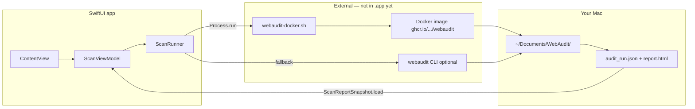
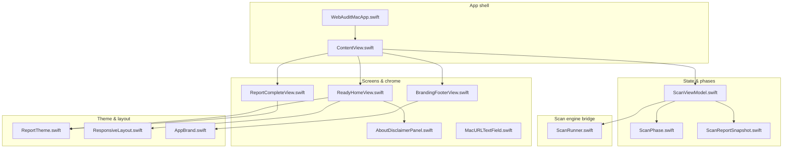
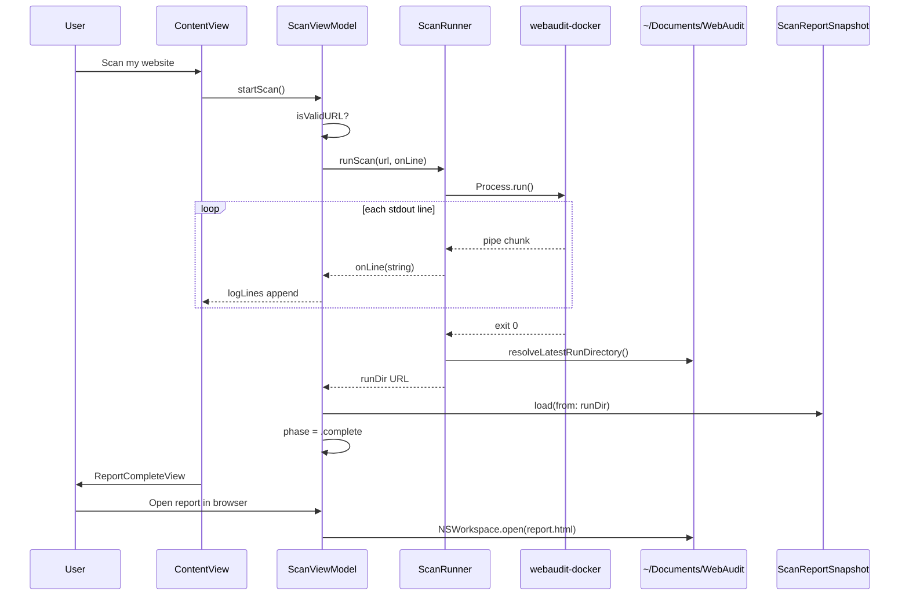
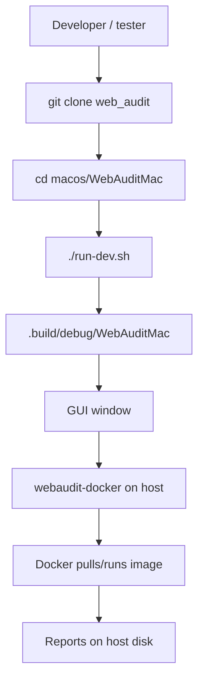
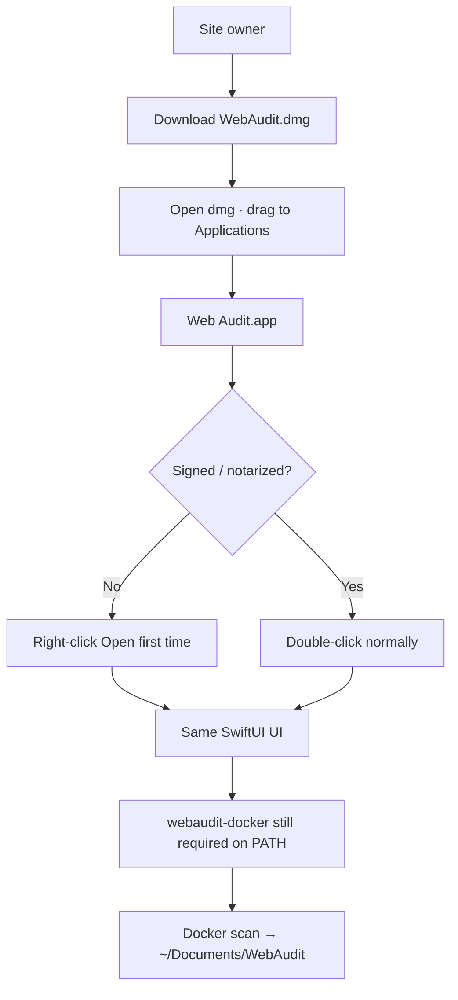

# WebAudit Pro for Mac - Swift Notes

**Status:** - Early alpha prototype. <br>
**Engine:** - External (`webaudit-docker` or `webaudit` CLI)<br> 
**Distribution:** - dev binary for now , will get `.dmg` going later.

This document explains the following:<br>
>- How the SwiftUI app is structured:<br>
>- What each file does:<br> 
>- How modules talk to each other:<br> 
>- and how development builds differ from a future installable `.dmg` logic.

**Quick links**

| Resource | Path |
|----------|------|
| Build & run (short) | [README.md](README.md) |
| HTML wireframes (design) | [designs/swift/](../../designs/swift/) |
| User-flow Mermaid diagrams | [designs/swift/user-flow.md](../../designs/swift/user-flow.md) |
| Mockup gallery | [designs/swift/index.html](../../designs/swift/index.html) |
| Platypus alternative (deferred) | [designs/platypus/](../../designs/platypus/) |
| Docker engine install | [v2_python_core/docs/docker_ci.md](../../v2_python_core/docs/docker_ci.md) |
| Plain-English product copy | [v2_python_core/docs/getting_started_plain.md](../../v2_python_core/docs/getting_started_plain.md) |

---

## What this P.O.C app is:

A **native macOS window** for site owners who do not want Terminal. <br>
User can paste a URL, click **Scan my website**, watch a live log, then get an in-app summary plus buttons to open the full HTML report.

The app does **not** embed the Python scanner yet. It **spawns a subprocess** — either `webaudit-docker` (Docker wrapper) or native `webaudit` — and reads stdout/stderr into the UI.



Compare with the design mockups: [designs/swift/user-flow.md](../../designs/swift/user-flow.md) (happy path, error path, post-scan actions).

---

## App Screenshots:

Replace the empty image paths below after you walk through the app. Suggested folder: `macos/WebAuditMac/docs/screenshots/`.

| Screen | Mockup reference | Screenshot placeholder |
|--------|------------------|------------------------|
| Ready — hero, URL, feature grid | [01-ready.html](../../designs/swift/01-ready.html) |  |
| Scanning — live log | [02-scanning.html](../../designs/swift/02-scanning.html) |  |
| Complete — scores & verdict | [03-complete.html](../../designs/swift/03-complete.html) |  |
<!-- | Error — retry | [04-error.html](../../designs/swift/04-error.html) |  |
| Help sheet | [05-help-advanced.html](../../designs/swift/05-help-advanced.html) |  | -->
<!-- | Advanced disclosure | [05-help-advanced.html](../../designs/swift/05-help-advanced.html) |  |
| Session history | *(beyond mockups)* |  |
| v1 shell edition dialog | *(beyond mockups)* |  | -->

---

## Libraries and frameworks (no third-party packages)

`Package.swift` declares **zero external dependencies**. Everything comes from Apple’s SDKs:

| Import | What it is | Why we use it |
|--------|------------|---------------|
| **SwiftUI** | Declarative UI framework | Buttons, layouts, sheets, `ScrollView`, dark-theme cards, `ButtonStyle` |
| **AppKit** | macOS native UI (older layer) | `NSApplication`, `NSWorkspace`, `NSTextField`, `NSSavePanel`, `NSSharingServicePicker`, `NSImage` |
| **Foundation** | Core types, URLs, files, JSON | `Process`, `FileManager`, `URL`, `JSONSerialization`, `Task`/`async` |
| **Darwin** | Low-level POSIX | `kill(pid, SIGKILL)` when cancel must force-stop a stuck subprocess |
| **os** | Apple concurrency helpers | `OSAllocatedUnfairLock` for thread-safe process slot and stdout buffer |
| **UniformTypeIdentifiers** | File types | `.html` on save panel |

**Swift language features**

- `@MainActor` — UI state must update on the main thread (`ScanViewModel`).
- `@Published` / `ObservableObject` — when `logLines` changes, SwiftUI redraws the log view.
- `@StateObject` / `@ObservedObject` — ownership of the view model in `ContentView`.
- `async`/`await` + `Task` — scan runs without freezing the window.
- `NSViewRepresentable` — wraps AppKit `NSTextField` inside SwiftUI (`MacURLTextField`).

---

## Module map — file → responsibility

Think of the app in **four layers**: shell → state → engine → presentation.



### App entry & window

| File | Role |
|------|------|
| **`WebAuditMacApp.swift`** | `@main` entry point. Creates `WindowGroup` with `ContentView`. Default window ~1280×1240 (wider than mockups). `AppDelegate` calls `NSApp.activate` so keyboard focus works when launched from Terminal. Quit via menu or ⌘Q. |
| **`ContentView.swift`** | **Root router.** Switches UI by `viewModel.phase`: ready / scanning / complete / error. Hosts header, footer links, Help sheet, Advanced `DisclosureGroup`, v1 shell dialog. Contains `LiveLogView` (monospaced log + auto-scroll) and `HelpSheet`. |

### State machine & view model

| File | Role |
|------|------|
| **`ScanPhase.swift`** | **Phase enum:** `.ready`, `.scanning`, `.complete(reportDir, summary)`, `.error(message)`. Also `CompletedScan` (session history row) and `ScanEngineInfo` (docker vs CLI vs missing). |
| **`ScanViewModel.swift`** | **Brain of the UI.** Holds `urlText`, `phase`, `logLines`, `completedScans` (max 10), `activeReport`. Methods: `startScan()`, `cancelScan()`, `openReportInBrowser()`, `downloadReport()`, `shareReport()`, `reopenScan()`. Validates URL (http/https + host). Subscribes to app terminate to kill subprocess. |
| **`ReportBundleExporter.swift`** | **Share-safe export.** `report.html` links to `report.css` in the same folder — saving HTML alone breaks styling. Builds a zip with both files plus `HOW-TO-OPEN.txt` for download/share. |
| **`ReportShareSheet.swift`** | **Share chooser.** Lists apps macOS detects for the zip (Mail, Messages, AirDrop, WhatsApp if installed, etc.) via `NSSharingService`. **More sharing options…** opens the full system picker. |
| **`ScanReportSnapshot.swift`** | **Report JSON → UI model.** Reads `audit_run.json` from the run folder. Builds hygiene/exposure, verdict, metric chips (mirrors Python `build_metric_chips`), top ACTION findings. Fallback if JSON incomplete. Defines `ScoreBand`, `ReportTone`, `MetricChipTone`. |

### Engine bridge (subprocess)

| File | Role |
|------|------|
| **`ScanRunner.swift`** | **Runs webaudit.** Detects engine on PATH / env. Spawns `Process`, pipes stdout+stderr, splits lines, strips ANSI color codes. Docker path: `webaudit-docker --output-dir documents --open none -y scan URL -v`. CLI path: `webaudit scan URL -v --open none -o ~/Documents/WebAudit`. Resolves latest run dir via `.webaudit-last-run` marker or newest folder. Cancel: `terminate()` then `SIGKILL` after 3s. |

### Screens (widgets)

| File | Role |
|------|------|
| **`ReadyHomeView.swift`** | **Home / ready phase.** Hero card, `MacURLTextField`, Scan button, 9-item “What you get” grid, `AboutDisclaimerPanel`, optional “This session” history (`ScanHistoryRow`, `VerdictPill`, `ScoreMiniPill`). |
| **`ReportCompleteView.swift`** | **Success phase.** Site hero, verdict banner, circular score cards, metric chip grid, “What to fix first”, action buttons, `SessionHistoryStrip`. **Button styles** live here: `ReportPrimaryButtonStyle`, `ReportAccentButtonStyle`, `ReportSecondaryButtonStyle`. Private subviews: `ScoreCardView`, `ReportMetricChip`. |
| **`AboutDisclaimerPanel.swift`** | **Legal/education panel** on home: what it is / is not, links to help and v1 shell edition. |
| **`BrandingFooterView.swift`** | Footer: Vtools trademark image, muzar.io + GitHub links, © line. `onDarkBackground` toggles colors. |
| **`MacURLTextField.swift`** | **AppKit URL field** inside SwiftUI — reliable typing/paste/focus (SwiftUI `TextField` was flaky when switching from Terminal). Monospace 15pt. Enter key triggers scan. |

### Design system (colors, fonts, layout)

| File | Role |
|------|------|
| **`ReportTheme.swift`** | **Color palette** aligned with v2 HTML report CSS (`--cyan`, `--lime`, `--gold`, `--coral`). `canvas`, `surface`, `text`, `muted`. Helpers: `metricChipColor`, `bandColor`, `toneAccent`. `ReportAmbientBackground` — dark gradient backdrop on ready/complete. |
| **`ResponsiveLayout.swift`** | **Responsive sizing.** `LayoutMetrics` scales fonts/padding from window width (`scale`, `isTwoColumn`, `featureColumns`). `trackContentWidth` preference key measures container width. `FeatureItem` model for the 9 feature rows. |
| **`AppBrand.swift`** | **URLs & assets.** GitHub links, v1 `web_audit.sh` read/download URLs, trademark PNG loader (`Bundle` → `WEBAUDIT_REPO/png/`). `WebAuditMark` (globe+shield icon), `TrademarkLink`. |

### Resources & tooling

| Path | Role |
|------|------|
| **`Resources/webaudit.png`** | App icon source / fallback image |
| **`Resources/vtool-trademark.png`** | Footer trademark |
| **`run-dev.sh`** | Builds if needed, sets `WEBAUDIT_REPO` + `WEBAUDIT_DOCKER_SCRIPT`, launches binary in **background** so Terminal does not steal keyboard focus |
| **`Package.swift`** | Swift Package Manager manifest — single executable target, macOS 13+ |

---

## How modules call each other (scan lifecycle)



**Cancel path:** User clicks **Cancel scan** → `ScanViewModel.cancelScan()` → `ScanRunner.terminateScan()` → phase back to `.ready`.

**Error path:** Invalid URL → phase `.error` without subprocess. Engine missing / non-zero exit / no report folder → `.error` with message from `ScanRunnerError`.

---

## UI building blocks (widgets & styles)

| Widget / style | Defined in | Purpose |
|----------------|------------|---------|
| `MacURLTextField` | `MacURLTextField.swift` | URL input |
| `LiveLogView` | `ContentView.swift` | Monospaced scrolling log |
| `WebAuditMark` | `AppBrand.swift` | Hero icon (gradient circle + SF Symbol) |
| `TrademarkLink` | `AppBrand.swift` | Clickable footer logo |
| `ReportAmbientBackground` | `ReportTheme.swift` | Dark cyan/violet gradients |
| `ReportPrimaryButtonStyle` | `ReportCompleteView.swift` | Cyan→violet gradient — main CTAs |
| `ReportAccentButtonStyle` | `ReportCompleteView.swift` | Cyan border glow — “Open report” |
| `ReportSecondaryButtonStyle` | `ReportCompleteView.swift` | Flat surface — secondary actions |
| `ScoreCardView` | `ReportCompleteView.swift` | Circular progress ring for 0–100 scores |
| `ReportMetricChip` | `ReportCompleteView.swift` | Critical / High / Verify / Plugins counts |
| `ScanHistoryRow` | `ReadyHomeView.swift` | Session history list item |
| `VerdictPill` / `ScoreMiniPill` | `ReadyHomeView.swift` | Compact badges on history rows |

**Font sizes** mostly come from `LayoutMetrics` (scale with window width): section titles ~17pt, body ~13pt, captions ~11.5pt. Scanning/error phases use system `.headline` / `.caption` on light `textBackgroundColor` log panel.

---

## Environment variables (dev & engine discovery)

| Variable | Set by | Effect |
|----------|--------|--------|
| `WEBAUDIT_REPO` | `run-dev.sh` or you | Adds `{repo}/v2_python_core/scripts/webaudit-docker.sh` and `.venv/bin/webaudit` to search paths |
| `WEBAUDIT_DOCKER_SCRIPT` | `run-dev.sh` or you | Highest-priority docker wrapper path |
| `WEBAUDIT_VENV` | optional | Native `webaudit` inside a venv |

Engine search order is implemented in `ScanRunner.resolveDockerWrapperCandidates()` and `resolveWebauditCandidates()`.

---

## Under the hood: **now** (dev build) vs **later** (.dmg installer)

### Now — Swift Package executable

| Aspect | What happens |
|--------|----------------|
| **Artifact** | `.build/debug/WebAuditMac` or `.build/release/WebAuditMac` — a single binary, not a `.app` bundle |
| **Launch** | `./run-dev.sh` (recommended) or `open .build/debug/WebAuditMac` |
| **Gatekeeper** | Unsigned binary from local build is usually fine. First Finder open may need **Right-click → Open**. |
| **Scan engine** | **Separate install:** Docker Desktop + `webaudit-docker` on PATH, or dev venv `webaudit` |
| **Reports** | `~/Documents/WebAudit/<timestamped-run>/` with `audit_run.json`, `report.html`, etc. |
| **Updates** | `git pull` + `swift build` again |
| **Icon in Dock** | Generic executable icon unless you wrap in `.app` |



### Later  / soon — `.dmg` installer

| Aspect | What changes |
|--------|----------------|
| **Artifact** | `Web Audit.app` inside a `.dmg` (drag to Applications) |
| **Bundle** | `Info.plist`, `Contents/MacOS/WebAuditMac`, `Contents/Resources/` (icons, PNGs) |
| **Launch** | Double-click from Applications — same GUI code inside |
| **Gatekeeper (unsigned)** | macOS may block first open. User: **Right-click → Open** once, or clear quarantine: `xattr -cr "/Applications/Web Audit.app"` |
| **Gatekeeper (notarized)** | Apple notarization + stapling — double-click works without extra steps *(in progress)* |
| **Scan engine** | Still external for now (Docker); bundling engine inside `.app` is a future option |
| **Updates** | New `.dmg` from GitHub Releases or muzar.io — replace app in Applications |



**Important:** A `.dmg` is only **packaging**. The Swift source in this repo stays the same; you add an Xcode **App** target (or a script) to produce `Web Audit.app`, then wrap it in a disk image.

---

## Making an installable app **without** Apple notarization

Can be shipped to trusted users without paying for notarization. It'll still work, macOS just shows stronger warnings. - will fix that when PROD ready.

### Option A — Zip the raw binary (simplest)

```bash
cd macos/WebAuditMac
swift build -c release
zip -j WebAuditMac-dev.zip .build/release/WebAuditMac
```

Recipient runs from Terminal or automates with `run-dev.sh`. Good for internal testers who already have Docker.

### Option B — Manual `.app` bundle (unsigned)

Typical layout:

```
Web Audit.app/
  Contents/
    Info.plist
    MacOS/
      WebAuditMac          # release binary
    Resources/
      webaudit.png
      vtool-trademark.png
```

Minimal `Info.plist` keys: `CFBundleExecutable`, `CFBundleIdentifier`, `CFBundleName`, `CFBundlePackageType` = `APPL`, `LSMinimumSystemVersion` = `13.0`.

Users may see *“cannot be opened because the developer cannot be verified”* → **Right-click → Open**.

### Option C — Ad-hoc code sign (still not notarized)

```bash
codesign --force --deep --sign - "Web Audit.app"
```

The `-` means “sign with ad-hoc identity” (no Apple Developer account). Reduces some local warnings; **does not** replace notarization for download-from-internet scenarios.

### Option D — Clear quarantine after download

When users download a zip/dmg from the web, macOS sets quarantine:

```bash
xattr -cr "/Applications/Web Audit.app"
```

### What notarization adds later

| | Unsigned / ad-hoc | Notarized + stapled |
|--|-------------------|---------------------|
| First open from internet | Often blocked or scary dialog | Usually silent |
| Enterprise policies | May be blocked | Generally allowed |
| User trust | “Open anyway” friction | Normal Mac app experience |

The app README [Distribution section](README.md#distribution-later) tracks DMG / notarization / muzar.io download page status.

---

## Mapping mockups → implemented Swift

| Mockup screen | Swift implementation | Notes |
|---------------|----------------------|-------|
| [01-ready.html](../../designs/swift/01-ready.html) | `ReadyHomeView` + `AboutDisclaimerPanel` | **Richer than mockup:** 9-feature grid, session history, two-column layout |
| [02-scanning.html](../../designs/swift/02-scanning.html) | `ContentView.scanningView` + `LiveLogView` | Matches: live log, cancel |
| [03-complete.html](../../designs/swift/03-complete.html) | `ReportCompleteView` | **Richer than mockup:** parses JSON, score rings, chips, fix-first list |
| [04-error.html](../../designs/swift/04-error.html) | `ContentView.errorView` | Retry + log preserved |
| [05-help-advanced.html](../../designs/swift/05-help-advanced.html) | `HelpSheet` + footer `DisclosureGroup` | Advanced shows engine path |

Design CSS reference: [designs/swift/swift-mock.css](../../designs/swift/swift-mock.css) — colors ported into `ReportTheme.swift`.

---

## Study guide (if you are new to Swift)

Suggested reading order:

1. **`ScanPhase.swift`** — small enums, easy win.
2. **`ReportTheme.swift`** — colors only, no logic.
3. **`ContentView.swift`** — see how `switch viewModel.phase` picks screens.
4. **`ScanViewModel.swift`** — how UI actions trigger work.
5. **`ScanRunner.swift`** — `Process` API, the bridge to Python/Docker.
6. **`ScanReportSnapshot.swift`** — JSON parsing pattern.
7. **`ReadyHomeView.swift` / `ReportCompleteView.swift`** — layout patterns.

**SwiftUI concepts to look up:** `View` protocol, `some View`, `@State` vs `@Binding`, `VStack`/`HStack`, `.sheet`, `.buttonStyle`.

**AppKit bridge:** `MacURLTextField` is the one place we drop to AppKit for macOS-native text input.

---

## Related docs to keep in sync

- [README.md](README.md) — install, run, stop scans, cleanup
- [../README.md](../README.md) — macOS folder index
- [designs/swift/README.md](../../designs/swift/README.md) — mockup gallery (links here for implementation)
- [designs/README.md](../../designs/README.md) — design assets index

---

## Changelog (doc only)

| Date | Note |
|------|------|
| 2026-06-05 | Initial guide — module map, libraries, dev vs dmg, screenshot placeholders |
