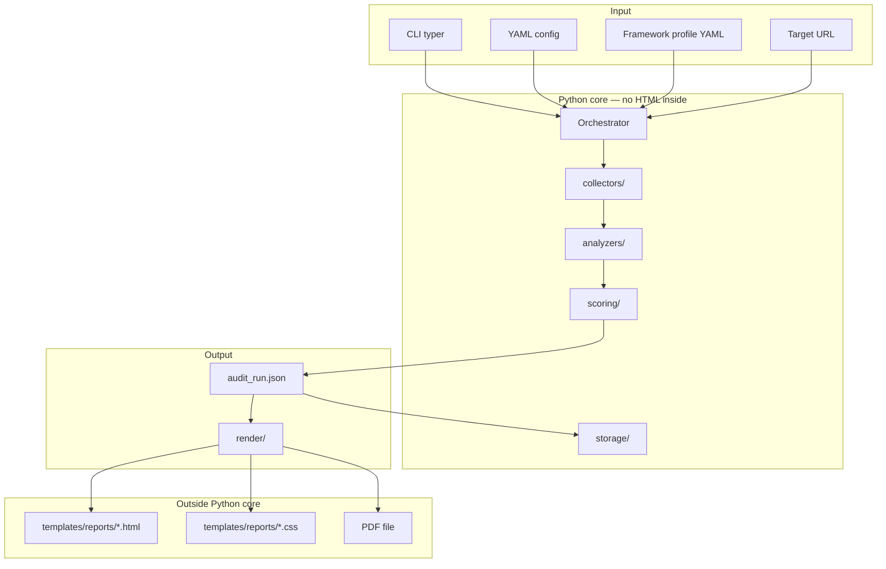
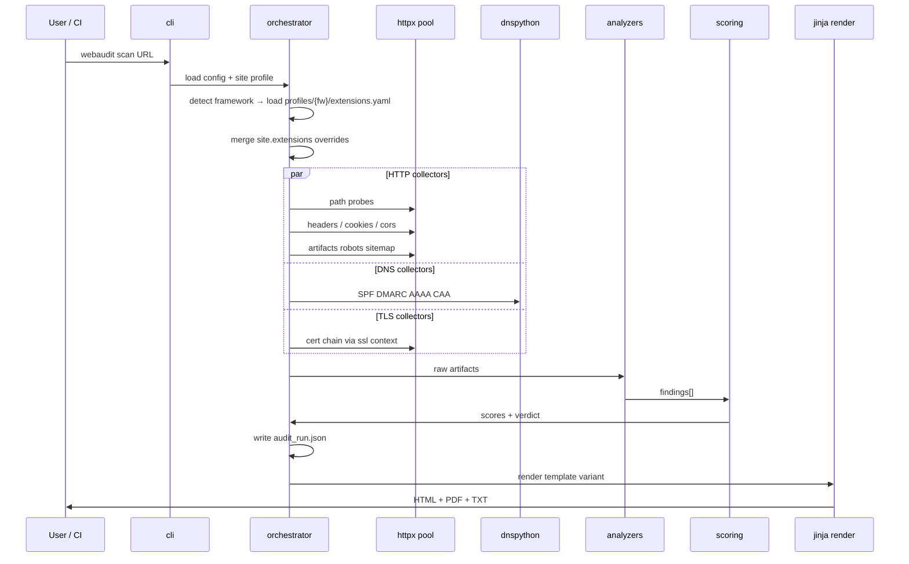
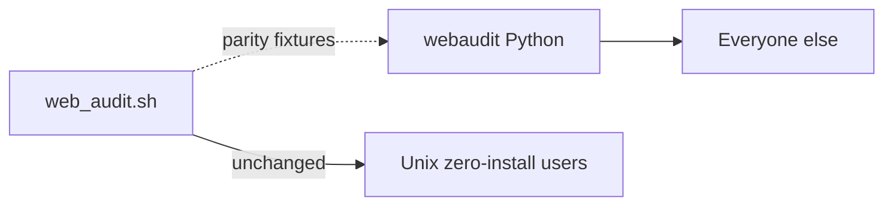

# Web Audit v2 — Architecture

*Modules, libraries, data flow, and why I chose each piece.*

---

## System context



---

## Pipeline (one scan)



> **Current (2.1.0b2):** Full Tier 1 pipeline + Stage 5 complete — extensions (`scan_html`), SEO surface, DNS enrichment (A/MX/NS/ASN), owner report, baseline diff, Tier 2 JS/API/links, bot-protection detection, dynamic dashboard focus pie. Diagram shows the complete Tier 1 target architecture.

**Extensions step (2.1.0b1):** After HTML collection, `pipeline._step_extensions` fingerprints plugins/packages from `artifacts.inventory.html.scan_html` (full homepage). Framework fingerprint body is fallback only; `robots.txt` hints when WAF blocks homepage.

---

## Package structure (implemented — 2.1.0b2)

See [implementation_tracker.md](implementation_tracker.md) for the live module table. Summary:

```text
v2_python_core/
├── dev-venv.sh
├── pyproject.toml
├── webaudit/
│   ├── cli/                    # scan, report, diff, completion
│   ├── config/                 # settings.py + defaults.yaml
│   ├── collectors/             # headers, dns (+ asn, net_tools), paths, tls, bot_challenge, …
│   ├── collectors/extensions/  # wordpress, django, laravel, rails, generic
│   ├── analyzers/              # per-domain analyzers + extensions, seo_surface
│   ├── profiles/               # shipped framework YAML
│   ├── scoring/                # engine.py, diff.py
│   ├── render/                 # html, txt, pdf + dns_display, focus_pie, finding_display, …
│   ├── pipeline.py
│   └── models/
├── templates/reports/          # Jinja HTML + CSS (six variants; owner default)
├── tests/unit/                 # pytest (~181 tests)
└── docs/
```

---

## Package structure (full Tier 1 target)

```text
webaudit/
├── __init__.py
├── cli/
│   ├── main.py              # typer app entry
│   └── commands/
│       ├── scan.py
│       ├── report.py
│       ├── diff.py
│       └── config_cmd.py
├── config/
│   ├── loader.py            # YAML → pydantic Settings
│   ├── site.py              # per-site profile model
│   ├── profiles.py          # detect → load profiles/{framework}/
│   └── defaults.py
├── models/
│   ├── artifact.py          # RawCollectorOutput
│   ├── finding.py           # Finding, Class, Severity
│   ├── run.py               # AuditRun (JSON schema)
│   └── scores.py
├── collectors/
│   ├── base.py
│   ├── http_paths.py
│   ├── http_headers.py
│   ├── tls.py
│   ├── dns.py
│   ├── cookies.py
│   ├── rate_limit.py
│   ├── artifacts.py
│   ├── cors.py
│   ├── extensions/          # Tier 2b — unified WP/Django/Laravel/Rails
│   └── js.py                # Tier 2 — playwright
├── analyzers/
│   ├── policy.py
│   ├── html_dom.py
│   ├── framework.py
│   ├── extensions.py        # Tier 2b — registry compare
│   ├── plugin_vuln.py       # Tier 2b/3 — CVE cache
│   ├── seo_surface.py       # Tier 2c — INFO/VERIFY only
│   ├── cors.py
│   ├── graphql.py           # Tier 2
│   └── diff.py              # Tier 2
├── scoring/
│   ├── hygiene.py
│   ├── exposure.py
│   └── verdict.py
├── storage/
│   ├── runs.py              # audit_logs layout
│   ├── baseline.py          # sqlite Tier 2
│   └── vuln_cache.py        # Tier 2b — WPScan/wp.org cache
└── render/
    ├── jinja_env.py         # template search path only
    ├── html.py
    ├── txt.py
    └── pdf.py

profiles/                    # shipped YAML — NOT Python code
├── wordpress/extensions.yaml
├── django/extensions.yaml
├── laravel/extensions.yaml
├── rails/extensions.yaml
└── generic/extensions.yaml

templates/reports/           # NOT inside webaudit package
├── _shared/                 # discovery, dashboard, guide, footer partials
├── owner/                   # default combined report (dashboard + executive + technical tab)
├── executive/
│   ├── report.html
│   └── report.css
├── technical/
│   ├── report.html
│   └── report.css
├── dashboard/
├── digest/
└── minimal/
    ├── report.html
    └── report.css

tests/
├── unit/
├── fixtures/
└── integration/
```

---

## Layer responsibilities

| Layer | Gets | Produces | Why separate |
|-------|------|----------|--------------|
| **collectors** | URL, config limits | `RawArtifact` blobs | I/O bound; mock with pytest-httpx |
| **analyzers** | Raw artifacts | `Finding` list | Pure parsing; table-driven tests |
| **scoring** | Findings | `Scores`, `Verdict` | Math must be deterministic |
| **render** | `AuditRun` JSON | HTML/TXT/PDF | Designers edit templates without touching Python |
| **config** | YAML files | validated `Settings` | Fail fast before any network I/O |

---

## Library choices (why I picked them)

### httpx

- Async-native — I can probe paths concurrently with a semaphore (respect `max_concurrency` in config).
- HTTP/2 support — better than wrapping curl in subprocess.
- Same API for sync in simple mode and async in fast mode.
- I have used it before on production-adjacent tooling.

### dnspython

- Standard for DNS in Python — SPF/DMARC/CAA/A/AAAA/MX/NS without `dig` subprocess portability hell.
- ASN enrichment uses the same resolver against Team Cymru DNS (`origin.asn.cymru.com`).
- Optional host `whois` binary (not dnspython) for registrar summary when `use_host_tools: true`.
- Query timeouts fit my config model.

### cryptography + ssl (stdlib)

- Parse cert chains, key sizes, expiry — beyond `openssl s_client` grep in bash.
- Stays in Tier 1 without external SSL Labs dependency.

### beautifulsoup4 + lxml

- Parse HTML for forms, scripts, links — replace bash regex that breaks on real sites.
- lxml parser for speed on large truncated bodies.

### pydantic v2

- Config and `AuditRun` schema — JSON schema export for docs and fixture validation.

### jinja2

- Templates live in `templates/reports/` — Python only passes `AuditRun` dict/context.
- Three variants = three template folders, same data model.

### weasyprint (PDF extra)

- HTML+CSS → PDF on headless CI — fixes v1 browser dependency.
- If WeasyPrint is painful on some platform, I keep HTML as primary and document fallback.

### typer + rich

- CLI ergonomics for me; `--help` readable for semi-technical users.
- Progress bars during long probe lists.

### playwright (Tier 2, optional extra)

- Only when `--js` — SPAs on muzar.io-style stacks.
- Not a core dep — keeps install light.

---

## Data contract: `audit_run.json`

Single artifact between phases. Rough shape:

```json
{
  "schema_version": "2.0",
  "meta": { "target_url": "...", "started_at": "...", "webaudit_version": "..." },
  "config_snapshot": { },
  "scores": { "hygiene": 82, "exposure": 100, "verdict": "NEEDS_ATTENTION" },
  "findings": [ ],
  "artifacts": { "dns": { }, "tls": { }, "inventory": { }, "plugins": { }, "seo_surface": { } },
  "reports": { "html": "...", "pdf": "...", "json": "..." }
}
```

**Why:** I can run `webaudit collect -o run.json` on a server and `webaudit report run.json` on my laptop. Same pattern as Wireshark pcap → tshark → GUI.

---

## Concurrency model

```text
config.max_concurrency (default 8)
  → asyncio.Semaphore
  → httpx.AsyncClient(timeout=config.timeout_seconds)
  → collectors schedule tasks
  → gather with error isolation (one failed probe ≠ abort scan)
```

Rate limiting between probes: `config.probe_delay_ms` (v1 had `PROBE_THROTTLE_MS`).

---

## Config resolution order

```text
1. defaults.yaml (shipped)
2. ~/.config/webaudit/config.yaml (user)
3. ./webaudit.yaml (project)
4. --config path
5. site profile: site_configs/{host}.yaml or --site-config
6. framework detect OR target.framework forced
7. profiles/{framework}/extensions.yaml (auto-loaded)
8. site.extensions merge (overrides profile)
9. CLI flags (override specific keys)
```

Detail: [framework_profiles.md](framework_profiles.md).

---

## Report variant selection

```text
config.report.variant: owner | executive | technical | minimal | dashboard | digest
config.report.theme: dark | light | print
config.output.formats: [html, json, txt, pdf]
```

Render module loads `templates/reports/{variant}/report.html` + `.css` — never embedded in Python strings.

---

## Error handling philosophy

- Network errors → `Finding` with class **VERIFY**, not crash.
- Missing optional dep (playwright, weasyprint) → clear message + skip feature.
- Invalid config → exit code 2 before scan.
- Scan complete with errors → exit code 0 with findings; exit code 1 only if `--fail-under-hygiene` CI gate fails (v1 parity).

---

## Relationship to v1 bash



I will maintain a **parity matrix** in tests: which v1 checks map 1:1 to v2 module names.

**Extended diagrams** (product focus, tiers, pipeline, finding classes): [diagrams.md](diagrams.md) · [mockups/diagrams/index.html](../mockups/diagrams/index.html).

---

*Related: [stages.md](stages.md) · [scoring.md](scoring.md) · [config.md](config.md) · [framework_profiles.md](framework_profiles.md) · [seo_surface.md](seo_surface.md)*
