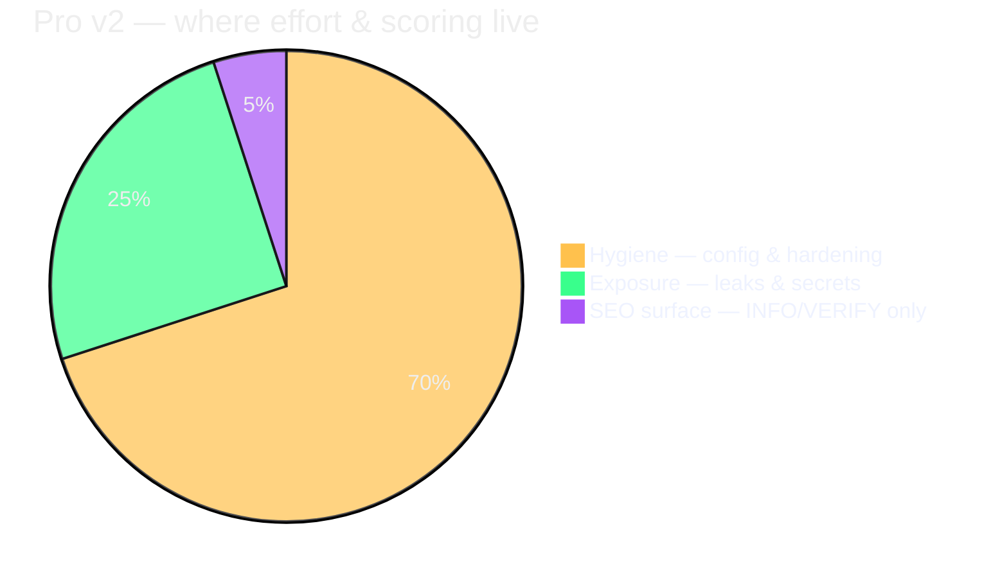
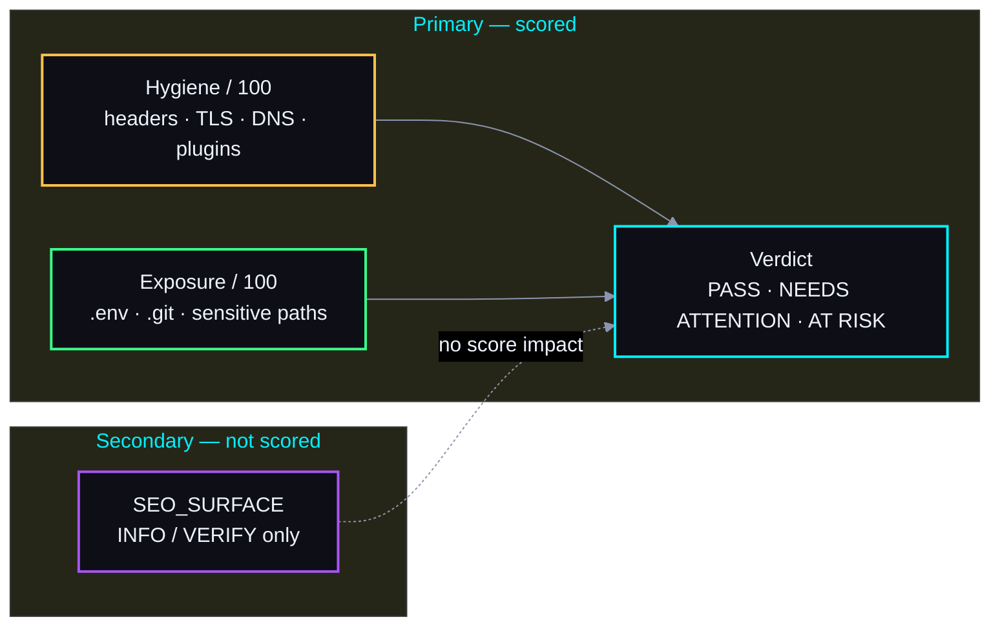
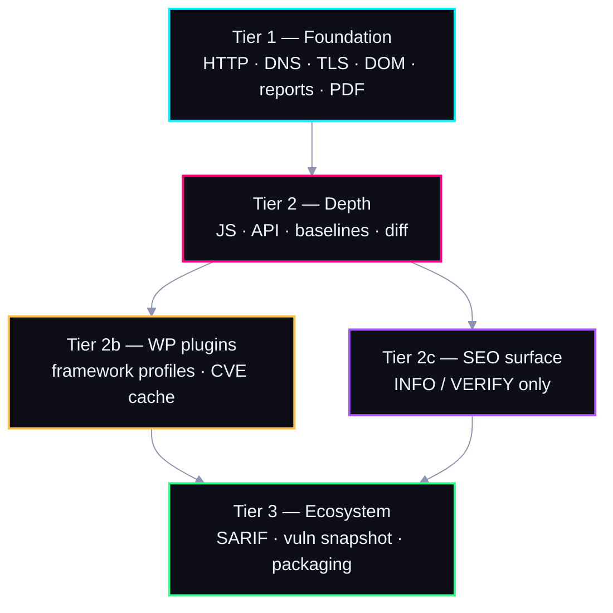
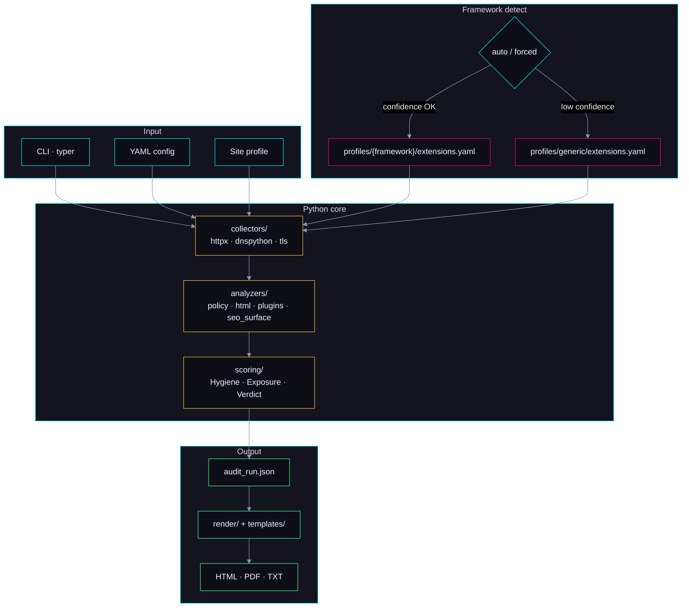
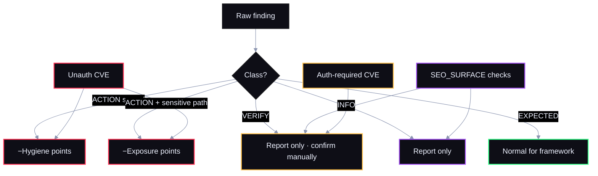
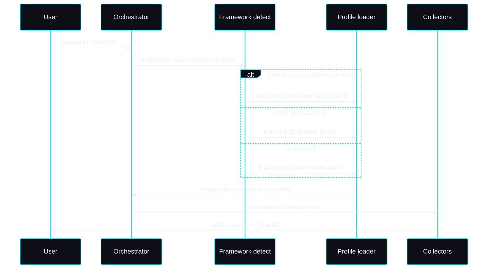

# Web Audit v2 — Architecture Diagrams

*Mermaid diagrams using the same dark palette as [mockups/reports/shared-dark.css](../mockups/reports/shared-dark.css).*

**Browser preview:** open [mockups/diagrams/index.html](../mockups/diagrams/index.html) for rendered diagrams with glow styling.

---

## Theme (paste at top of any diagram block)

```mermaid
%%{init: {
  'theme': 'base',
  'themeVariables': {
    'darkMode': true,
    'background': '#030306',
    'mainBkg': '#0e0e16',
    'secondBkg': '#14141f',
    'tertiaryColor': '#1a1a24',
    'primaryColor': '#0e0e16',
    'primaryTextColor': '#eef2ff',
    'primaryBorderColor': '#00f0ff',
    'secondaryColor': '#14141f',
    'secondaryTextColor': '#eef2ff',
    'secondaryBorderColor': '#ff0080',
    'tertiaryTextColor': '#8b95b0',
    'lineColor': '#8b95b0',
    'textColor': '#eef2ff',
    'nodeTextColor': '#eef2ff',
    'clusterBkg': '#14141f',
    'clusterBorder': '#00f0ff',
    'titleColor': '#00f0ff',
    'edgeLabelBackground': '#0e0e16',
    'pie1': '#ffc14d',
    'pie2': '#39ff8c',
    'pie3': '#a855f7',
    'pie4': '#00f0ff',
    'pieStrokeColor': '#030306',
    'pieLegendTextColor': '#eef2ff'
  }
}}%%
```

---

## 1. Pro v2 product focus

Primary job: **how safe and well-delivered** the public site is. SEO surface is informational only.





---

## 2. Tier stack



---

## 3. Scan pipeline (config → collect → score → report)



---

## 4. Finding classes — what affects scores



---

## 5. Framework profile resolution



---

## Color reference (matches report mockups)

| Token | Hex | Use in diagrams |
|-------|-----|-----------------|
| Background | `#030306` | Canvas |
| Surface | `#0e0e16` | Node fill |
| Cyan | `#00f0ff` | Primary / Tier 1 / CLI |
| Magenta | `#ff0080` | Tier 2 / profiles |
| Gold | `#ffc14d` | Hygiene |
| Lime | `#39ff8c` | Exposure / output |
| Violet | `#a855f7` | SEO surface |
| Coral | `#ff3355` | ACTION / risk |

---

*Related: [architecture.md](architecture.md) · [seo_surface.md](seo_surface.md) · [stages.md](stages.md)*
