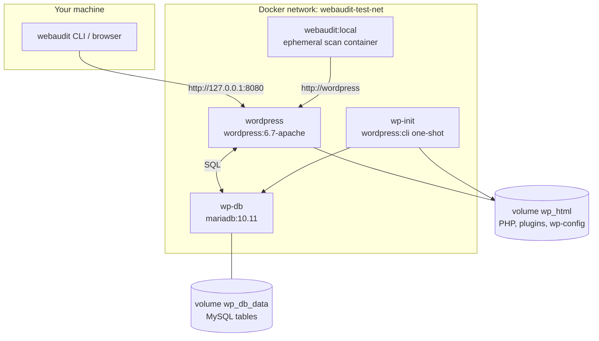
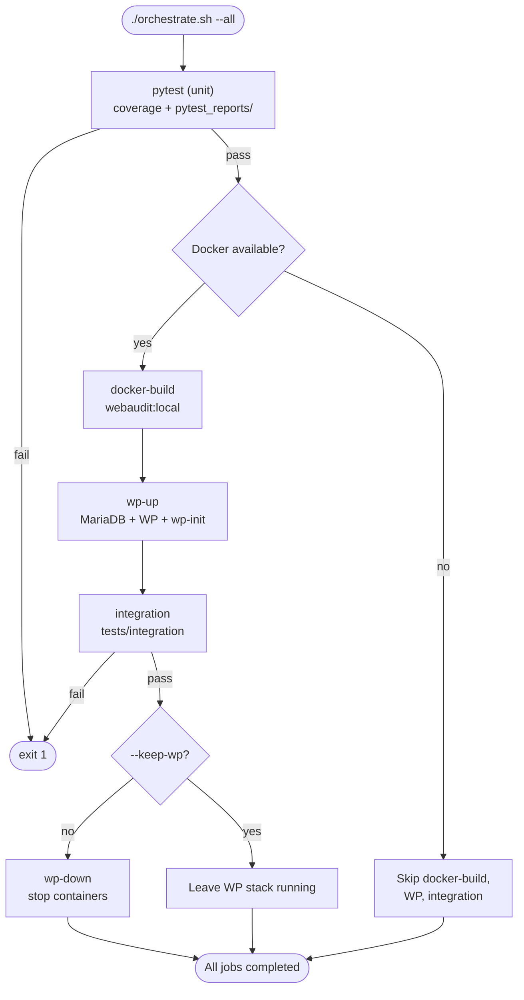
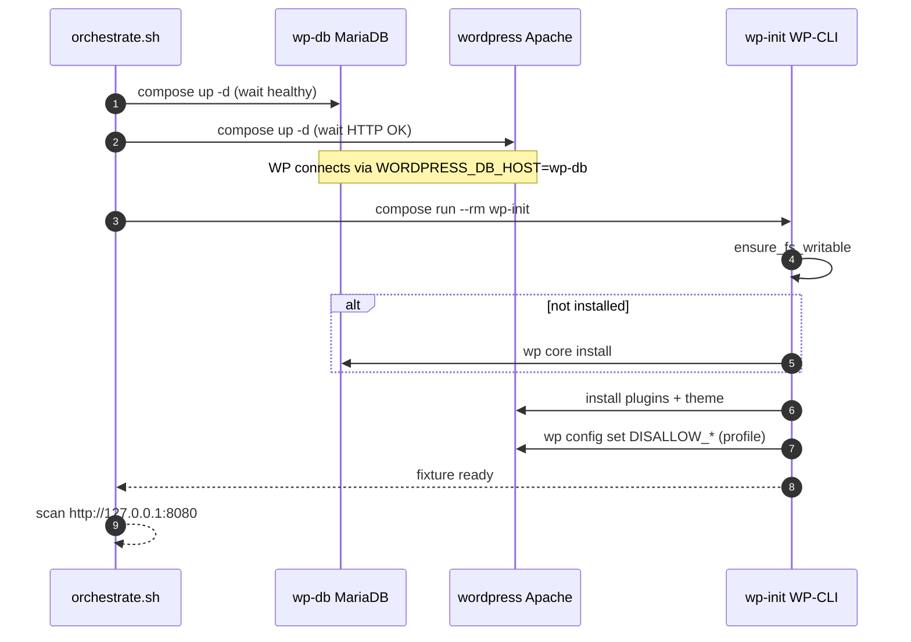
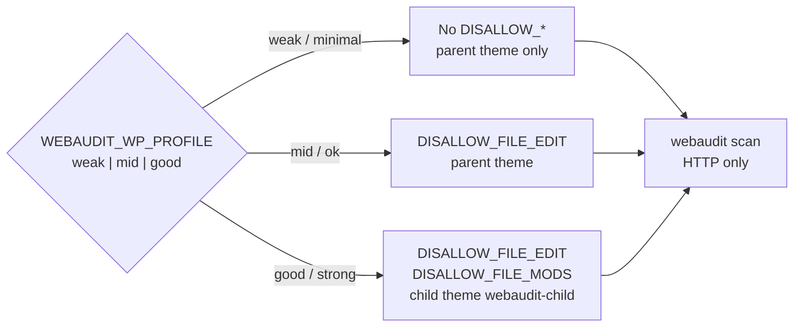
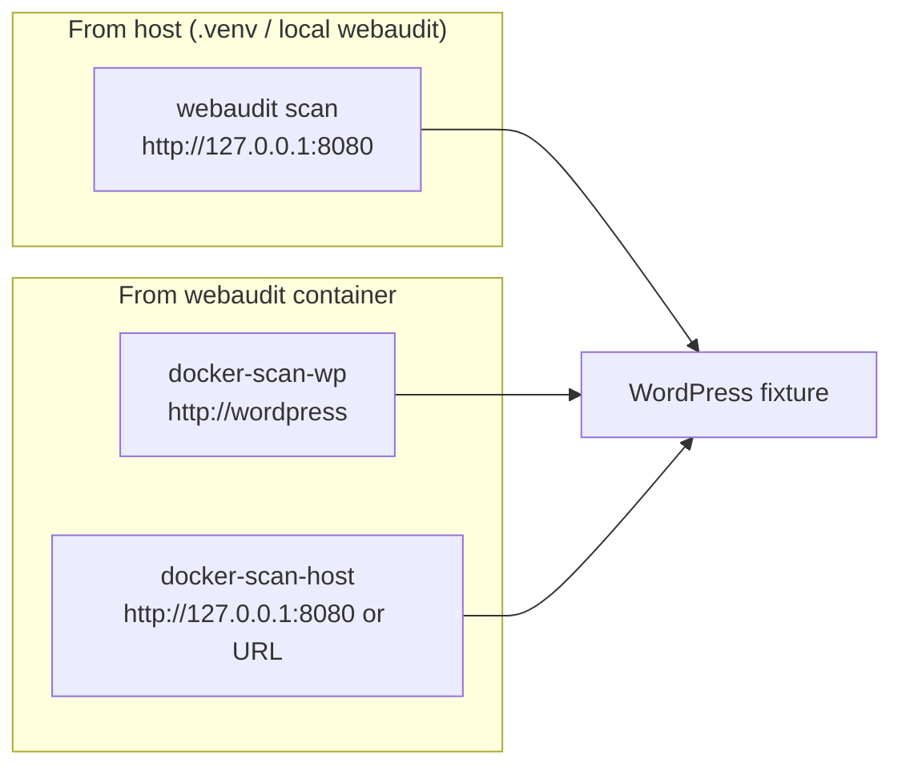
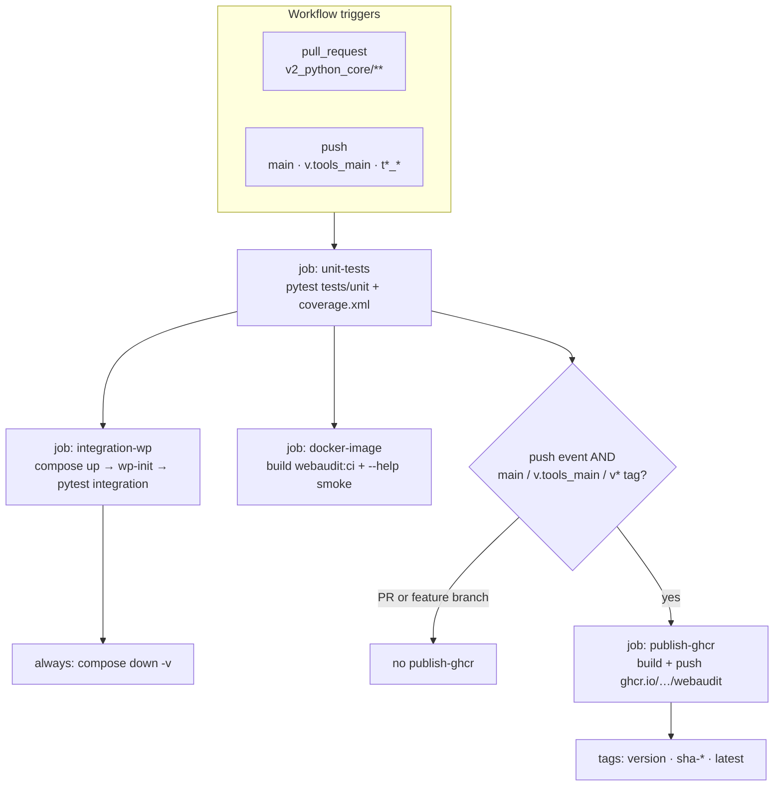
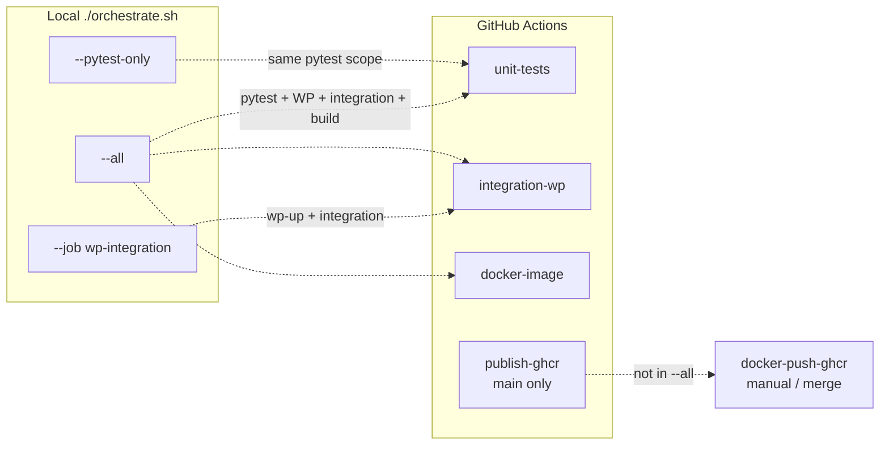

# Docker, CI, and local orchestration

Run **unit tests first**, then optional **WordPress Docker fixture** integration tests, and build the **webaudit Pro** image for Windows/macOS/Linux users who prefer Docker over a local Python venv.

Published images: **`ghcr.io/<your-github-user>/webaudit`** (GitHub Container Registry).

**Diagrams:** [Docker stack](#docker-test-stack-architecture) · [`--all` flow](#local-orchestrator---orchestrateshall---all) · [CI pipeline](#github-actions-ci-githubworkflowsciyml) · [scan paths](#scan-paths--host-vs-container)

---

## Quick start

```bash
cd v2_python_core

# Full local pipeline (pytest → build image → WP fixture → integration → teardown)
./orchestrate.sh --all

# Unit tests only (always run this before opening a PR)
./orchestrate.sh --pytest-only

# CI-style: unit tests, no browser prompt
./orchestrate.sh --pytest-only --no-report-prompt

# WordPress fixture + integration against profile "good"
./orchestrate.sh --job wp-integration --wp-profile good --keep-wp
```

---

## Diagrams

### Docker test stack (architecture)

WordPress needs **two** pulled images plus **two** persistent volumes. Web Audit only talks HTTP — never MariaDB directly.



### Local orchestrator — `./orchestrate.sh --all`

Default path runs unit tests first, then Docker jobs, then tears down WP unless `--keep-wp`.



### WordPress fixture startup (`wp-up`)



### WordPress hardening profiles

Applied in `docker/wp-test/init-wordpress.sh` after core install.



### Scan paths — host vs container



### GitHub Actions CI (`.github/workflows/ci.yml`)

Three jobs fan out after **unit-tests**; GHCR publish only on **push** to mainlines (not PRs).



### CI vs local orchestrator (parity)



---

## Orchestrator (`orchestrate.sh`)

Colored **JOB →** banners. Pytest uses **`-v -s -x -ra`** plus coverage (`htmlcov/`, `coverage.xml`) and a **dated HTML test report** (`pytest_reports/`).

Full command reference:

```bash
./orchestrate.sh --help    # or -h / --h — all flags, jobs, and colored examples
./orchestrate.sh --list    # job catalog + environment variables
```

| Job | What it does |
|-----|----------------|
| `pytest` | Unit tests under `tests/unit/` |
| `integration` | `tests/integration/` (needs `WEBAUDIT_WP_TEST_URL`) |
| `wp-up` | Start MariaDB + WordPress + `wp-init` |
| `wp-down` | Stop containers |
| `wp-reset` | Stop + delete volumes (fresh install) |
| `docker-build` | Build `webaudit:local` Pro image |
| `docker-push-ghcr` | Push `webaudit:local` to GHCR (after `docker login ghcr.io`) |
| `docker-scan-wp` | Scan `http://wordpress` from inside Docker network |
| `docker-scan-host` | Scan a host URL from webaudit container on `webaudit-test-net` |
| `wp-integration` | `wp-up` → `integration` → `wp-down` (unless `--keep-wp`) |

### Orchestrator flags

| Flag | Purpose |
|------|---------|
| `--all` | pytest → docker-build → wp-up → integration → wp-down |
| `--pytest-only` | Unit tests only (same as `--job pytest`) |
| `--job NAME` | Run one job; repeat for a chain (e.g. `--job docker-build --job wp-up`) |
| `--wp-profile weak\|mid\|good` | WordPress fixture hardening (default: `mid`) |
| `--keep-wp` | Skip `wp-down` after `--all` or `wp-integration` |
| `--no-report-prompt` | Skip “open pytest report in browser?” (CI / scripts) |
| `-y` / `--yes` | Skip GHCR double-confirm on `docker-push-ghcr` only |

### Pytest HTML reports (QA)

Each pytest run writes a **self-contained HTML report** with per-test **Test case** details (from docstrings or `@pytest.mark.test_case(...)`):

| Output | Path |
|--------|------|
| Dated pytest report | `pytest_reports/webaudit_pytest_YYYY-MM-DD_HHMMSS.html` |
| Coverage (separate) | `htmlcov/index.html` |

After pytest, the orchestrator asks whether to open the report in your browser (lists older reports by index). Manage reports standalone:

```bash
./scripts/pytest_reports.sh help
./scripts/pytest_reports.sh list
./scripts/pytest_reports.sh open 0          # newest
WEBAUDIT_SKIP_PYTEST_OPEN=1 ./orchestrate.sh --pytest-only   # no prompt
```

Requires `pytest-html` (`pip install -e '.[dev]'`).

### Python resolution order

1. `v2_python_core/.venv/bin/python` (from `./dev-venv.sh setup`)
2. `python3.12` / `python3` on PATH
3. Fallback: `python:3.12-slim` container for pytest only

### Environment

| Variable | Default | Purpose |
|----------|---------|---------|
| `WP_PORT` | `8080` | Host port for WordPress |
| `WEBAUDIT_WP_TEST_URL` | `http://127.0.0.1:8080` | Integration scan target |
| `WEBAUDIT_WP_PROFILE` | `mid` | Fixture hardening profile |
| `WEBAUDIT_IMAGE` | `webaudit:local` | Docker tag for Pro image |
| `GHCR_OWNER` | from `git remote` | GitHub user/org for manual push |
| `WEBAUDIT_SKIP_PYTEST_OPEN` | unset | Set to `1` to skip pytest report browser prompt |
| `WEBAUDIT_PYTEST_REPORTS_DIR` | `pytest_reports/` | Override dated HTML report directory |

---

## WordPress test profiles

Configured in `docker/wp-test/init-wordpress.sh` via WP-CLI after core install.

| Profile | Aliases | wp-config | Theme |
|---------|---------|-----------|-------|
| **weak** | `minimal` | No `DISALLOW_*` | Parent only |
| **mid** | `ok` | `DISALLOW_FILE_EDIT` | Parent only |
| **good** | `strong` | Both constants | Child theme `webaudit-child` |

Plugins installed: **Contact Form 7**, **Yoast SEO (wordpress-seo)**.  
Theme: **Twenty Twenty-Four** (child on `good`).

Web Audit **cannot read wp-config from outside** — profiles let you compare scan output and manual verification on a known local site.

```bash
WEBAUDIT_WP_PROFILE=weak ./orchestrate.sh --job wp-up
webaudit scan http://127.0.0.1:8080 -v --open html
```

---

## webaudit Pro Docker image

### Pull from GHCR (after CI publish or manual push)

Replace `Vlad-1618M` with your GitHub username/org:

```bash
docker pull ghcr.io/Vlad-1618M/webaudit:latest
docker run --rm ghcr.io/Vlad-1618M/webaudit:latest scan https://example.com --open none
```

Tags pushed by CI:

| Tag | When |
|-----|------|
| `2.1.0b2` (package version) | Every publish |
| `latest` | Push to `v.tools_main` or `main` |
| `sha-abc1234` | Git commit short SHA |
| `v2.1.0b2` | Git tag starting with `v` |

### Build locally

```bash
cd v2_python_core
./orchestrate.sh --job docker-build

docker run --rm webaudit:local scan https://example.com --open none
```

Scan local WP fixture (join Docker network):

```bash
docker run --rm --network webaudit-test-net \
  -v "$(pwd)/audit_logs:/work/audit_logs" \
  webaudit:local scan http://wordpress -v --open none
```

Dockerfile: `docker/webaudit/Dockerfile`

---

## GitHub Container Registry (GHCR)

### Do you need to set up the registry first?

**No.** The package is **created automatically on the first push**. No repo checkbox or empty package required.

After the first publish:

1. Open **GitHub → Packages → webaudit**
2. **Package settings → Link repository** → `web_audit`
3. Confirm visibility is **Public** (recommended for a public tool)

### Automatic publish (CI)

Workflow: `.github/workflows/ci.yml` — job **`publish-ghcr`**

Runs when **unit tests pass** and you **push** to:

- `v.tools_main`
- `main`
- Any tag starting with `v` (e.g. `v2.1.0b2`)

**Pull requests:** build + smoke test only — **no push** (so forks cannot publish to your GHCR).

Uses `GITHUB_TOKEN` with `packages: write` — no extra secrets required.

### Manual publish from GitHub UI

Workflow: **Actions → Publish GHCR image → Run workflow**

Optional extra tag input. Always pushes version from `webaudit/__version__.py` and `latest`.

### Manual publish from your machine

While testing locally:

```bash
cd v2_python_core

# 1. Build
./orchestrate.sh --job docker-build

# 2. Log in (once per machine)
gh auth login
gh auth token | docker login ghcr.io -u YOUR_GITHUB_USER --password-stdin

# 3. Push (prompts twice — public GHCR package; use --yes to skip in scripts)
./orchestrate.sh --job docker-push-ghcr

# Or explicitly:
GHCR_OWNER=Vlad-1618M ./orchestrate.sh --job docker-push-ghcr
```

PAT alternative (classic token scopes: `read:packages`, `write:packages`):

```bash
echo "$GITHUB_PAT" | docker login ghcr.io -u YOUR_GITHUB_USER --password-stdin
docker tag webaudit:local ghcr.io/YOUR_GITHUB_USER/webaudit:2.1.0b2
docker push ghcr.io/YOUR_GITHUB_USER/webaudit:2.1.0b2
docker push ghcr.io/YOUR_GITHUB_USER/webaudit:latest
```

**Safety prompts:** `./orchestrate.sh --job docker-push-ghcr` asks **twice** (y/N) before uploading — the image is **public** on GHCR and overwrites `:latest` / version tags. `docker-build` alone never pushes. Use `--yes` only in non-interactive scripts when you mean to publish.

### Docker Hub (optional mirror)

Same image, different registry — tag and push separately if you want `docker pull youruser/webaudit` on Docker Hub. GHCR is enough for most GitHub-hosted projects.

---

## GitHub Actions (PR gate)

See also: [CI pipeline diagram](#github-actions-ci-githubworkflowsciyml) and [local vs CI parity](#ci-vs-local-orchestrator-parity).

| Workflow | Purpose |
|----------|---------|
| `.github/workflows/ci.yml` | Unit tests + WP integration + Docker build + **GHCR publish on main** |
| `.github/workflows/publish-ghcr.yml` | Manual **Run workflow** publish |
| `.github/workflows/security.yml` | CodeQL, pip-audit, dependency review on PRs |
| `.github/dependabot.yml` | Weekly pip + Actions updates |

PRs touching `v2_python_core/**` must pass **unit-tests** before merge.

Local parity with CI:

```bash
./orchestrate.sh --pytest-only
# or non-interactive:
./orchestrate.sh --pytest-only --no-report-prompt
```

QA can review the dated HTML report under `pytest_reports/` — each test row expands to a **Test case** description. Override per test with a docstring or `@pytest.mark.test_case("…")` in unit tests.

---

## Manual Docker Compose (without orchestrator)

```bash
cd v2_python_core
export WEBAUDIT_WP_PROFILE=mid
docker compose -f docker/docker-compose.yml up -d wp-db wordpress
docker compose -f docker/docker-compose.yml run --rm wp-init
curl -I http://127.0.0.1:8080/
WEBAUDIT_WP_TEST_URL=http://127.0.0.1:8080 pytest tests/integration -v -m integration
docker compose -f docker/docker-compose.yml down -v
```

---

## What integration tests assert

See `tests/integration/test_wp_docker_scan.py`:

- Framework detected as **wordpress**
- At least one **plugin** observed
- **Theme** slug from HTML / `style.css`
- **Child theme** on `good` profile
- **wp-config hardening VERIFY** when wp-login is reachable (mentions `DISALLOW_FILE_EDIT` and `DISALLOW_FILE_MODS`)

---

## Related docs

- [testing.md](testing.md) — unit vs integration pyramid
- [getting_started_plain.md](getting_started_plain.md) — non-technical overview
- [wordpress_theme_threat_model.md](wordpress_theme_threat_model.md) — theme / DISALLOW_* rationale
