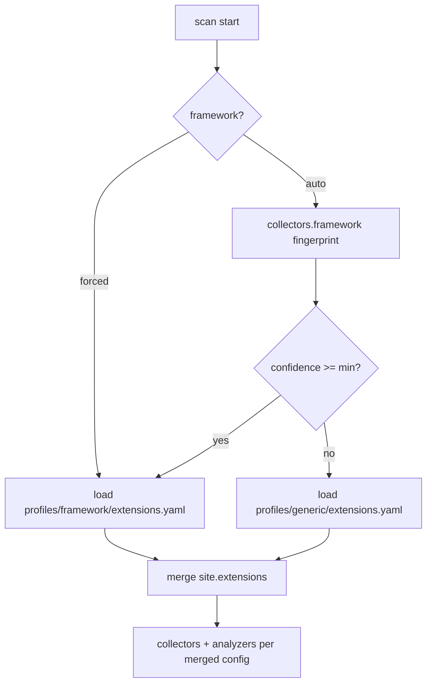

# Web Audit v2 — Framework Profiles

*When framework X is detected (or forced), load profile X — data-driven extension/plugin intelligence instead of hardcoded bash arrays.*

---

## Why I need this

v1 embeds WordPress high-risk plugin slugs inside `check_plugin_versions()` — always probes readme.txt even for plugins not observed in HTML. That is noisy and not configurable.

v2 separates:

1. **Framework detection** — same signals as v1 (headers, cookies, body)
2. **Framework profile** — shipped YAML defaults per stack
3. **Site config** — client-specific overrides
4. **Runtime discovery** — only probe what HTML/assets actually reference (unless profile opts in)

Full threat-model research: [plugin_vulnerability_research.md](plugin_vulnerability_research.md).

---

## Resolution order

```text
1. defaults.yaml
2. user ~/.config/webaudit/config.yaml
3. project webaudit.yaml
4. --config path
5. site profile site_configs/{host}.yaml
6. framework detect OR target.framework forced
7. auto-load profiles/{framework}/extensions.yaml   ← NEW
8. merge site.extensions section (overrides profile)
9. CLI flags
```



---

## Profile file locations

**Shipped (package):**

```text
webaudit/profiles/
  wordpress/extensions.yaml
  django/extensions.yaml
  laravel/extensions.yaml
  rails/extensions.yaml
  generic/extensions.yaml
```

**Mockups (this repo today):**

```text
v2_python_core/mockups/config/profiles/
  wordpress/plugins.example.yaml
  django/packages.example.yaml
  laravel/packages.example.yaml
  generic/php.example.yaml
```

WordPress uses `plugins`; Django/Laravel use `packages` — same schema shape, different probe paths.

---

## Shared schema (extensions block)

```yaml
framework: wordpress
min_detection_confidence: 0.65   # auto mode only

probe:
  mode: observed_only              # observed_only | watchlist_if_observed | aggressive
  sources:
    - html_assets                  # /wp-content/plugins/slug/?ver=
    - readme_txt                   # Stable tag field
  readme_fetch: observed_only      # fix v1 blind high-risk GETs

compare:
  wporg_api: true                  # free plugins only
  semver_engine: packaging         # Python packaging.version

vuln:
  enabled: false                   # Tier 2b / Tier 3
  source: cache                    # cache | wpscan | wporg_only
  cache_ttl_days: 14
  api_daily_budget: 25             # WPScan free tier
  auth_required_default_class: VERIFY

scoring:
  hygiene_cap: 30                  # max hygiene deduction from PLUGIN* categories
  exposure_on_unauth_cve_only: true

watchlist:
  - slug: elementor
    tier: critical
    premium: false
  - slug: elementor-pro
    tier: critical
    premium: true
    vuln_source: wpscan_only
    compare_latest: false          # no wordpress.org API

aliases:
  elementor-pro: elementor_pro     # normalize slug variants

labels:
  stale_premium: verify_updates    # never "nulled" in automated output
  unknown_slug: review
```

---

## Site config overrides

```yaml
# site_configs/acme-widgets.com.yaml
host: acme-widgets.com
framework: auto   # or wordpress

extensions:
  inherit_profile: true
  probe:
    mode: observed_only
  extra_watch:
    - custom-client-plugin
  ignore:
    - hello-dolly
  expected:
    - slug: wordfence
      note: "Client pays for premium — verify license separately"
```

---

## Framework-specific behavior

| Framework | Profile file | Fingerprint unit | Primary sources |
|-----------|--------------|------------------|-----------------|
| **wordpress** | `wordpress/extensions.yaml` | plugin `slug` | `wp-content/plugins/`, readme.txt, wp.org API |
| **django** | `django/extensions.yaml` | app / package hint | DEBUG, admin static, optional lockfile path |
| **laravel** | `laravel/extensions.yaml` | composer hint | debug pages, exposed vendor (bad) |
| **rails** | `rails/extensions.yaml` | gem hint | info endpoints, static paths |
| **generic** | `generic/extensions.yaml` | — | version disclosure only; no vuln DB |

Django does **not** reuse WordPress plugin logic — same pipeline, different profile.

---

## Detection confidence

Report in Technical variant:

```text
Framework: wordpress (auto, confidence 0.87)
Signals: wp-cookies, wp-json body, generator meta
Profile: profiles/wordpress/extensions.yaml
```

If confidence < `min_detection_confidence` → generic profile + VERIFY finding “framework unclear.”

---

## Tier placement

| Capability | Tier |
|------------|------|
| Profile loader + merge | **Tier 2** (Stage 5) |
| WP slug/version from HTML + readme | **Tier 2b** |
| wp.org latest compare | **Tier 2b** |
| WPScan/CVE cache | **Tier 3** |
| Joomla/Magento profiles | **Future** |

See [stages.md](stages.md) for Tier 2b detail.

---

*Related: [config.md](config.md) · [plugin_vulnerability_research.md](plugin_vulnerability_research.md) · [scoring.md](scoring.md)*
