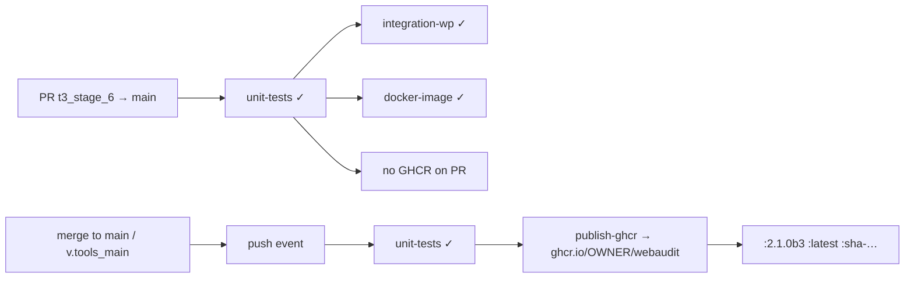

# Release flow — `t3_stage_6` → `2.1.0b3`

Working notes for comparing commits, doc sync, push, tag, and GHCR. **Not** a permanent doc — delete or archive after release.

---

## Commits on branch (newest first)

| Commit | Summary |
|--------|---------|
| `fd650e4` | Docker CI stack, orchestrate.sh, pytest reports, GHA, WP fixture, GHCR, Mermaid in docker_ci.md |
| `9ffcbf1` | DISALLOW_FILE_MODS in wp-config hardening advisory |
| `9cbb4a0` | WP theme fingerprint, live path probe progress, `--js` help |
| `16d8e3d` | Docs updates |
| `654671e` | Docs updates |

**Base before this arc:** `5715a04` T2 wrap (#7) → shipped **2.1.0b2**.

---

## Doc sync commit (after your Docker commit)

These files were updated to **2.1.0b3** alignment:

- `webaudit/__version__.py` → `2.1.0b3`
- `CHANGELOG.md` → `[2.1.0b3]` section; `[Unreleased]` = deferred Tier 3 only
- `README.md`, `docs/stages.md`, `docs/implementation_tracker.md`, `docs/architecture.md`

### Suggested commit message

```
docs: sync Stage 6 CI status and bump to 2.1.0b3

Align CHANGELOG, stages, implementation tracker, and README with
Docker/orchestrate/GHCR work on t3_stage_6. Version 2.1.0b3.
```

---

## Suggested tag

**Tag name:** `v2.1.0b3`

**Annotated message:**

```
Web Audit v2.1.0b3 — Stage 6 CI/Docker harness

- orchestrate.sh + WordPress MariaDB fixture (weak/mid/good)
- GitHub Actions: unit, WP integration, docker build, GHCR on main
- pytest HTML QA reports; ~201 unit tests
- WP theme fingerprint; live path probe streaming
```

### Commands (you run)

```bash
cd v2_python_core   # or repo root — tag from root is fine

# After doc sync commit + push
git push -u origin t3_stage_6

# Tag the commit that includes version bump (usually tip after doc sync)
git tag -a v2.1.0b3 -m "Web Audit v2.1.0b3 — Stage 6 CI/Docker harness"
git push origin v2.1.0b3
```

---

## Merge → main flow (GHCR)



| Event | GHCR push? |
|-------|------------|
| PR to main | **No** — build + test only |
| Push to `t3_stage_6` (feature branch) | **No** |
| Merge/push to `main` or `v.tools_main` | **Yes** — after unit-tests pass |
| Push tag `v2.1.0b3` | **Yes** — tag ref also triggers publish (per ci.yml) |
| Manual | Actions → Publish GHCR image |

---

## Local parity checklist

```bash
cd v2_python_core
./orchestrate.sh --pytest-only --no-report-prompt    # ≈ GHA unit-tests
./orchestrate.sh --job wp-integration                # ≈ GHA integration-wp
./orchestrate.sh --job docker-build                    # ≈ GHA docker-image
# GHCR: only on merge or ./orchestrate.sh --job docker-push-ghcr (manual, double confirm)
```

---

## What's still open (unchanged by CI stack)

See `CHANGELOG.md` `[Unreleased]`:

- Live **WPScan API** (`vuln.source: wpscan` uses offline snapshot today)
- httpx **cassettes** (optional; WP integration covers live fixture path)
- INI→YAML, Homebrew, i18n

**Shipped in `[Unreleased]`:** plugin/theme CVE cache (snapshot + sqlite), SARIF export (`--sarif`).

---

## Version / tag comparison

| | 2.1.0b2 | 2.1.0b3 |
|---|---------|---------|
| Stage 5 product | ✓ complete | + themes, path streaming, DISALLOW_FILE_MODS |
| Docker / CI | — | ✓ |
| Integration tests | planned | ✓ WP Docker |
| GHCR | — | ✓ on main |
| Unit tests | ~193 | ~201 |
