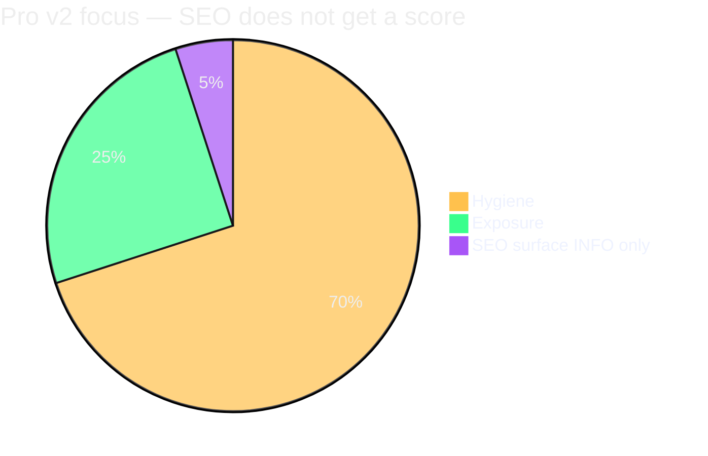

# Web Audit v2 — SEO Surface (Tier 2c)

*Small informational slice for site owners who were sold “SEO” — never a scored SEO success rate.*

---

## Product line (non-negotiable)

| Priority | What Pro measures | Scored? |
|----------|-------------------|---------|
| **Primary** | How **well hardened** and **safe** the delivered public site is | Hygiene + Exposure |
| **Secondary** | How **discoverable / well-formed** the public HTML surface looks to crawlers | **INFO / VERIFY only** |

**No third score.** No rankings, no Search Console, no “SEO success %”, no lead-generation promises.

v1 already said: *“Not SEO or performance scores.”* Tier 2c adds **context for the $5k buyer**, not an Ahrefs replacement.

---

## Category: `SEO_SURFACE`

All findings use category **`SEO_SURFACE`** (or sub-tags in `item`). Default class:

- **INFO** — observation worth knowing; ask dev if unsure
- **VERIFY** — might be intentional (staging, noindex launch); confirm manually

**Never ACTION** by default → **zero Hygiene / Exposure impact** unless I explicitly override in `scoring_rules.yaml` (I won't for v2.0).

---

## Checks (planned)

| Item | Signal | Class | Notes |
|------|--------|-------|-------|
| Homepage `noindex` | `<meta name="robots" content="noindex">` | VERIFY | Common accident on “live” sites |
| Missing meta description | No `meta name="description"` on homepage | INFO | Agency oversight |
| Duplicate / missing canonical | Zero or multiple `link rel="canonical"` | INFO | |
| `robots.txt` blocks all | `Disallow: /` | VERIFY | May be staging |
| `robots.txt` blocks key paths | Disallow on `/`, `/blog/`, etc. | VERIFY | Cross-check sitemap |
| Sitemap declared but 404 | robots `Sitemap:` URL fails | INFO | v1 artifacts overlap |
| Sitemap empty / tiny | Parsed URL count below threshold | INFO | |
| Broken internal links (sample) | Tier 2 `analyzers.links` | INFO | Quality, not security |
| Designer / creator credit | v1 ATTRIBUTION parity | INFO | Placement note only |
| `hreflang` conflicts | Obvious mismatches | INFO | Optional |
| Open Graph missing on homepage | No `og:title` / `og:image` | INFO | Social/SEO adjacent |

**Out of scope:** keyword density, Core Web Vitals, PageSpeed score, Google ranking, indexing status API, schema.org completeness scoring.

---

## Modules

| Module | Tier | Role |
|--------|------|------|
| `analyzers.seo_surface` | 2c | DOM + robots/sitemap cross-check → INFO/VERIFY findings |
| `analyzers.links` | 2 | Broken links → INFO under `SEO_SURFACE` |
| `collectors.artifacts` | 1 | robots/sitemap raw data (reused, not duplicated) |

Depends on Tier 1 **HTML DOM parser** (`analyzers.html_dom`). Optional **Playwright** (`--js`) improves SPA meta tag visibility — findings tagged `source: js` in evidence.

---

## Config

```yaml
collectors:
  seo_surface:
    enabled: true              # Tier 2c — default on when module ships
    check_meta_robots: true
    check_canonical: true
    check_meta_description: true
    check_open_graph: false    # optional noise on minimal sites
    check_broken_links: true   # delegates to analyzers.links sample
    max_internal_links_sample: 20

scoring:
  seo_surface_affects_scores: false   # hard default — do not set true in shipped defaults
```

Site override example:

```yaml
collectors:
  seo_surface:
    enabled: true
    check_open_graph: true   # client cares about social previews
```

---

## Report UX

**Executive** — one collapsed section:

> **Discoverability (informational)** — These are not security failures. They may affect how search engines see your site. Share with your developer if something looks wrong.

No red verdict driven by SEO alone.

**Technical** — table under `#seo-surface` with Class column always INFO/VERIFY.

**Minimal** — omit section by default or max 3 bullets.

---

## Relationship to security findings

```text
Security (Hygiene/Exposure)  →  "Is the site safe and properly hardened?"
SEO_SURFACE (INFO/VERIFY)    →  "Does the public surface look cared-for for crawlers?"
```

A site can be **PASS** on Verdict with many SEO INFO items. A site can be **AT_RISK** with perfect meta tags.

---

## Tier placement

| Tier | Content |
|------|---------|
| **2c** | `analyzers.seo_surface` + report section + config |
| Shares **Stage 5** with Tier 2 / 2b (Extend) |

Exit criteria: see [stages.md](stages.md).

---

## Owner-facing disclaimer (template copy)

```text
Discoverability checks are informational only. They do not measure Google rankings,
lead generation, or SEO campaign success. Primary scores reflect security hygiene
and public exposure of sensitive files.
```

## Visual overview



Full diagram set: [diagrams.md](diagrams.md) · [mockups/diagrams/index.html](../mockups/diagrams/index.html)

---

*Related: [scoring.md](scoring.md) · [roadmap.md](roadmap.md) · [stages.md](stages.md) · [diagrams.md](diagrams.md)*
